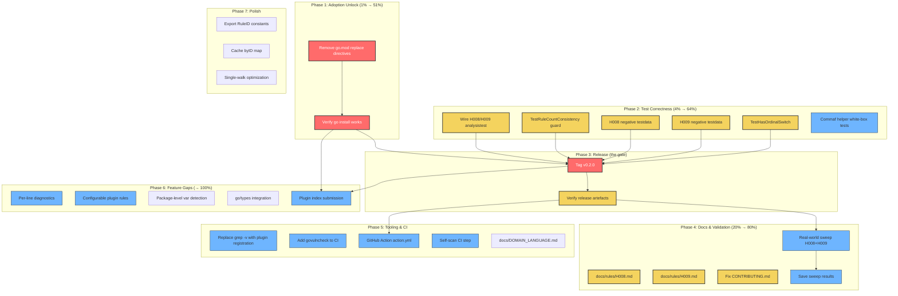

# go-humanize-linter — Pareto Execution Plan: Road to v0.2.0 Release

> **Date:** 2026-07-30 21:19
> **Goal:** Take go-humanize-linter from "great code nobody can install" to a **released, validated, externally-adoptable v0.2.0** — and lay the groundwork for v0.3+.

---

## Context

The linter has 9 working rules (H001–H009), a CLI, a Go library, a golangci-lint plugin,
93.8% plugin coverage, 0 lint issues, scoped `//nolint` suppression, and honest docs.
The code quality is high. But **the project is trapped behind a wall**:

1. **Nobody can install it.** `go.mod` has `replace` directives pointing at local sibling
   repos (`../go-finding`, `../go-linter-sdk`, `../go-error-family`). The tagged versions exist
   (`go-finding v1.4.1`, `go-linter-sdk v0.1.0`, `go-error-family v0.10.0`) — they were used at
   v0.1.0 — but the replaces were re-added for local dev and never removed. `go install` fails.
   The golangci-lint plugin loader can't resolve the module. The plugin index submission is blocked.

2. **Two of nine rules are untested through the plugin path.** `TestAnalyzerAnalysistest`
   runs H001–H007 only, even though `h008positive` and `h009positive` fixtures exist.

3. **No anti-regression guard for the "ghost rule" class of bug.** H009 shipped invisible
   (detector + test existed but it wasn't registered). It happened once; nothing prevents a repeat.

4. **H008/H009 have never been validated against real code.** The "~0% FP" claim covers H001–H007
   only. A user who installs, gets a false positive on H009 in their first run, uninstalls forever.

---

## Pareto Breakdown

### The 1% that delivers 51%

**Remove the `go.mod` replace directives.** The tagged versions exist (`go-finding v1.4.1`,
`go-linter-sdk v0.1.0`, `go-error-family v0.10.0` — same as v0.1.0). Removing the replaces
and `go mod tidy`-ing unlocks `go install`, golangci-lint plugin loading, the plugin index
submission, external CI integration, and every downstream adoption path. Without this,
every other improvement polishes a product nobody can use.

### The 4% that delivers 64%

1. **Remove replace directives** (the 1% above)
2. **Wire H008/H009 analysistest fixtures** into the test run (2 lines — the fixtures exist)
3. **`TestRuleCountConsistency`** — anti-ghost-rule guard (10 lines, blocks the H009 bug class)
4. **Tag `v0.2.0`** — the code is shipped, CHANGELOG is written, the tag is the only missing piece

### The 20% that delivers 80%

1–4. Above 5. **Negative testdata for H008/H009** — clean code that must NOT flag 6. **`docs/rules/H008.md` + `H009.md`** — users clicking from README find nothing today 7. **CONTRIBUTING.md fix** — correct dev commands + rule-addition checklist 8. **`TestHasOrdinalSwitch`** — test parity with every other rule 9. **White-box tests for `pattern_commaf.go` helpers** — silent-regression prevention 10. **Real-world validation sweep of H008/H009** — extend the "~0% FP" claim

### The other 20% (to get to 100%)

11. Replace `nix run .#lint` `grep -v` with `.golangci.yml` plugin registration
12. Per-line diagnostics (report at the pattern, not func-decl)
13. Configurable rules in plugin mode via `Analyzer.Flags`
14. GitHub Action composite `action.yml`
15. Package-level `var` detection for H007
16. go/types type-aware detection
17. Auto-fix support via `go-finding` `FixEngine`
18. `--config` flag for YAML/TOML rule configuration
19. Publish to golangci-lint plugin index
20. Benchmarks against k8s/cockroach

---

## Phase Breakdown: Medium Tasks (30–100 min each)

> Sorted by Priority = `Impact × CustomerValue ÷ Effort` (higher = do first).
> Effort: `XS` ≤30 min · `S` ≤1 h · `M` ≤4 h · `L` ≥½ day.

### Phase 1: The Adoption Unlock (1% → 51%)

| #   | Task                                                                | Effort | Impact | Priority | Depends on |
| --- | ------------------------------------------------------------------- | ------ | ------ | :------: | ---------- |
| 1.1 | Remove `go.mod` replace directives, require tagged versions, verify | XS     | 5      | **25.0** | —          |
| 1.2 | Verify `go install` works with no local sibling repos               | XS     | 5      | **25.0** | 1.1        |

### Phase 2: Test Correctness & Anti-Regression (4% → 64%)

| #   | Task                                                                 | Effort | Impact | Priority | Depends on |
| --- | -------------------------------------------------------------------- | ------ | ------ | :------: | ---------- |
| 2.1 | Wire H008/H009 analysistest fixtures into `TestAnalyzerAnalysistest` | XS     | 5      | **25.0** | —          |
| 2.2 | `TestRuleCountConsistency` anti-ghost-rule guard                     | XS     | 5      | **25.0** | —          |
| 2.3 | Negative testdata for H008 (`h008_negative/main.go`)                 | XS     | 4      | **20.0** | —          |
| 2.4 | Negative testdata for H009 (`h009_negative/main.go`)                 | XS     | 4      | **20.0** | —          |
| 2.5 | `TestHasOrdinalSwitch` table-driven test (6+ cases)                  | XS     | 4      | **20.0** | —          |
| 2.6 | White-box tests for `pattern_commaf.go` helpers (4 tests)            | S      | 4      | **8.0**  | —          |

### Phase 3: Release v0.2.0 (the gate)

| #   | Task                                           | Effort | Impact | Priority | Depends on   |
| --- | ---------------------------------------------- | ------ | ------ | :------: | ------------ |
| 3.1 | Tag `v0.2.0` on `main`                         | XS     | 5      | **25.0** | 1.1, 2.1–2.5 |
| 3.2 | Verify release workflow fires, artefacts build | XS     | 4      | **20.0** | 3.1          |

### Phase 4: Documentation & Validation (20% → 80%)

| #   | Task                                                         | Effort | Impact | Priority | Depends on |
| --- | ------------------------------------------------------------ | ------ | ------ | :------: | ---------- |
| 4.1 | `docs/rules/H008.md` (match H001–H007 format)                | XS     | 3      | **15.0** | —          |
| 4.2 | `docs/rules/H009.md`                                         | XS     | 3      | **15.0** | —          |
| 4.3 | Fix CONTRIBUTING.md (dev commands + rule-addition checklist) | XS     | 3      | **15.0** | —          |
| 4.4 | Real-world validation sweep of H008 + H009 (190+ corpus)     | M      | 5      | **2.5**  | 1.1        |
| 4.5 | Save sweep results to `docs/validation/`                     | XS     | 3      | **15.0** | 4.4        |

### Phase 5: Tooling & CI

| #   | Task                                                               | Effort | Impact | Priority | Depends on |
| --- | ------------------------------------------------------------------ | ------ | ------ | :------: | ---------- |
| 5.1 | Replace `nix run .#lint` `grep -v` with `.golangci.yml` plugin reg | M      | 4      | **2.0**  | —          |
| 5.2 | Add `govulncheck` to CI                                            | XS     | 4      | **20.0** | —          |
| 5.3 | GitHub Action composite `action.yml`                               | S      | 3      | **6.0**  | 3.1        |
| 5.4 | Self-scan CI step (`go-humanize-linter ./` asserting 0 findings)   | S      | 3      | **6.0**  | —          |
| 5.5 | `docs/DOMAIN_LANGUAGE.md` glossary                                 | S      | 2      | **4.0**  | —          |

### Phase 6: Feature Gaps (the other 20% → 100%)

| #   | Task                                                    | Effort | Impact | Priority | Depends on |
| --- | ------------------------------------------------------- | ------ | ------ | :------: | ---------- |
| 6.1 | Per-line diagnostics (report at pattern, not func-decl) | L      | 5      | **1.3**  | —          |
| 6.2 | Configurable rules in plugin mode (`Analyzer.Flags`)    | M      | 3      | **1.5**  | —          |
| 6.3 | Package-level `var` detection for H007                  | M      | 2      | **1.0**  | —          |
| 6.4 | go/types type-aware detection                           | L      | 5      | **1.3**  | —          |
| 6.5 | `--config` flag for YAML/TOML rule configuration        | M      | 2      | **1.0**  | —          |
| 6.6 | Auto-fix support via `go-finding` `FixEngine`           | L      | 3      | **0.8**  | —          |
| 6.7 | Publish to golangci-lint plugin index                   | S      | 5      | **5.0**  | 1.1, 3.1   |
| 6.8 | Benchmarks against k8s/cockroach                        | M      | 3      | **1.5**  | —          |

### Phase 7: Polish

| #   | Task                                                         | Effort | Impact | Priority | Depends on |
| --- | ------------------------------------------------------------ | ------ | ------ | :------: | ---------- |
| 7.1 | Export `RuleIDH001`–`RuleIDH009` from `humanizelint` package | S      | 3      | **6.0**  | —          |
| 7.2 | Cache `byID` map in `rules.go` (`init()` once)               | XS     | 2      | **10.0** | —          |
| 7.3 | Single-walk optimization (AST cache for 9 rules = 1 walk)    | M      | 3      | **1.5**  | —          |
| 7.4 | `--explain Hxxx` examples in README                          | XS     | 2      | **10.0** | —          |
| 7.5 | Better SARIF (rule descriptions, help URIs, fix suggestions) | M      | 2      | **1.0**  | —          |
| 7.6 | `--output <file>` flag                                       | XS     | 2      | **10.0** | —          |

---

## Micro-Task Breakdown (max 12 min each)

> Each medium task decomposed into atomic steps. Sorted by phase, then by priority.

### Phase 1: The Adoption Unlock

| #    | Micro-task                                                             | Est |
| ---- | ---------------------------------------------------------------------- | --- |
| 1.1a | Read current `go.mod`, note the three replace directives               | 2m  |
| 1.1b | Remove the `replace (...)` block from `go.mod`                         | 2m  |
| 1.1c | Set `go-finding` to `v1.4.1`, `go-linter-sdk` to `v0.1.0` in require   | 3m  |
| 1.1d | Set `go-error-family` to `v0.10.0` (indirect)                          | 2m  |
| 1.1e | `GOPRIVATE=... GOEXPERIMENT=jsonv2 go mod tidy`                        | 3m  |
| 1.1f | `GOEXPERIMENT=jsonv2 go build ./...` — verify build passes             | 3m  |
| 1.1g | `GOEXPERIMENT=jsonv2 go test ./... -race -count=1` — verify tests pass | 5m  |
| 1.1h | `GOEXPERIMENT=jsonv2 go vet ./...` — verify vet passes                 | 2m  |
| 1.2a | Temporarily move sibling repos (`mv ../go-finding ../go-finding.bak`)  | 2m  |
| 1.2b | `GOEXPERIMENT=jsonv2 go build ./...` — verify no local-path fallback   | 3m  |
| 1.2c | Restore sibling repos (`mv ../go-finding.bak ../go-finding`)           | 2m  |
| 1.2d | `nix run .#lint` — verify 0 issues                                     | 5m  |

### Phase 2: Test Correctness & Anti-Regression

| #    | Micro-task                                                             | Est      |
| ---- | ---------------------------------------------------------------------- | -------- |
| 2.1a | Read `plugin/plugin_test.go:177` (`TestAnalyzerAnalysistest`)          | 2m       |
| 2.1b | Add `"./h008positive"` to the `analysistest.Run` call                  | 2m       |
| 2.1c | Add `"./h009positive"` to the `analysistest.Run` call                  | 2m       |
| 2.1d | `go test ./plugin/ -run TestAnalyzerAnalysistest -v` — verify passes   | 3m       |
| 2.1e | If fails: read the fixture `// want` comment, fix mismatch             | 5m       |
| 2.2a | Read `rules.go` — identify `AllRules()`, `allRuleDetectors()`          | 3m       |
| 2.2b | Write `TestRuleCountConsistency` — assert factory count == rule count  | 5m       |
| 2.2c | Assert every `rule_*.go` with `Rule*()` factory is in `AllRules()`     | 5m       |
| 2.2d | `go test ./... -run TestRuleCountConsistency -v` — verify passes       | 3m       |
| 2.3a | Read `testdata/h008_ordinal/main.go` for the positive pattern          | 3m       |
| 2.3b | Write `testdata/h008_negative/main.go` — `switch n%10` non-ordinal     | 5m       |
| 2.3c | Add negative test case in `linter_test.go`                             | 3m       |
| 2.3d | `go test ./... -run TestH008 -v` — verify negative does NOT flag       | 3m       |
| 2.4a | Read `testdata/h009_commaf/main.go` for the positive pattern           | 3m       |
| 2.4b | Write `testdata/h009_negative/main.go` — `%.Nf` alone, no comma loop   | 5m       |
| 2.4c | Add negative test case in `linter_test.go`                             | 3m       |
| 2.4d | `go test ./... -run TestH009 -v` — verify negative does NOT flag       | 3m       |
| 2.5a | Read `TestHasEqualsOneBranch` in `pattern_helpers_test.go` for pattern | 3m       |
| 2.5b | Read `hasOrdinalSwitch` in `pattern_ordinal.go` for inputs/outputs     | 3m       |
| 2.5c | Write `TestHasOrdinalSwitch` table with 6+ `boolSrcCase` entries       | 8m       |
| 2.5d | `go test ./... -run TestHasOrdinalSwitch -v` — verify passes           | 3m       |
| 2.6a | Read `pattern_commaf.go:102-167` — the 4 extracted helpers             | 3m       |
| 2.6b | Write `TestWalkFormatFloatVerbs` — `%%` escapes, widths, junk          | 8m       |
| 2.6c | Write `TestScanDottedPercentFloat` — `%.3f`, `%.0f`, malformed         | 8m       |
| 2.6d | Write `TestScanBarePercentFloat` — `%f`, `%3f`, malformed              | 8m       |
| 2.6e | Write `TestHasFormatFloatPrecision` — precision extraction             | 8m       |
| 2.6f | `go test ./... -run "TestWalk                                          | TestScan | TestHasFormat" -v` | 3m  |

### Phase 3: Release v0.2.0

| #    | Micro-task                                                    | Est |
| ---- | ------------------------------------------------------------- | --- |
| 3.1a | Verify CHANGELOG `[0.2.0]` is complete and accurate           | 3m  |
| 3.1b | Run final `nix run .#test` + `.#lint` + `.#build` — all green | 5m  |
| 3.1c | `git tag v0.2.0`                                              | 2m  |
| 3.1d | `git push origin v0.2.0` (triggers release workflow)          | 3m  |
| 3.2a | Check GitHub Actions tab — release workflow started           | 2m  |
| 3.2b | Verify release artefacts built (binaries, if configured)      | 5m  |
| 3.2c | Publish GitHub Release notes from CHANGELOG `[0.2.0]` section | 5m  |

### Phase 4: Documentation & Validation

| #    | Micro-task                                                             | Est |
| ---- | ---------------------------------------------------------------------- | --- |
| 4.1a | Read `docs/rules/H001.md` for the format template                      | 3m  |
| 4.1b | Write `docs/rules/H008.md` — ordinal detection, example, fix, suppress | 8m  |
| 4.2a | Write `docs/rules/H009.md` — commaf detection, example, fix, suppress  | 8m  |
| 4.3a | Read `CONTRIBUTING.md` (14 lines) and `flake.nix` dev commands         | 3m  |
| 4.3b | Rewrite dev-setup section with `GOEXPERIMENT=jsonv2` env or `nix run`  | 5m  |
| 4.3c | Add "Adding a Rule" checklist (rules.go, pattern_helpers, examples…)   | 8m  |
| 4.3d | Add "Adding a CLI Flag" checklist                                      | 3m  |
| 4.4a | Build the linter: `nix run .#build`                                    | 3m  |
| 4.4b | Run `go-humanize-linter --enable H008 --enable H009 ~/projects/`       | 10m |
| 4.4c | Collect finding counts, manually triage false positives                | 10m |
| 4.5a | Write `docs/validation/2026-07-30_v0.2-sweep.md` with results          | 8m  |

### Phase 5: Tooling & CI

| #    | Micro-task                                                            | Est |
| ---- | --------------------------------------------------------------------- | --- |
| 5.1a | Read `flake.nix` lint script — find the `grep -v` band-aid            | 3m  |
| 5.1b | Read `.golangci.yml` — understand current plugin/linter config        | 3m  |
| 5.1c | Research golangci-lint `plugins:` map syntax for custom analyzers     | 8m  |
| 5.1d | Add `gohumanize` to `.golangci.yml` `plugins:` section                | 5m  |
| 5.1e | Remove `grep -v` from `flake.nix` lint script                         | 2m  |
| 5.1f | `nix run .#lint` — verify 0 issues, no `nolint_filter` warning        | 3m  |
| 5.2a | Add `govulncheck` step to `.github/workflows/ci.yml`                  | 5m  |
| 5.3a | Create `action.yml` composite action skeleton                         | 5m  |
| 5.3b | Wire inputs (`path`, `enable`, `disable`, `format`) to CLI invocation | 5m  |
| 5.3c | Add "Use in GitHub Actions" section to README                         | 5m  |
| 5.4a | Add self-scan step to CI: build linter, run on own source             | 5m  |
| 5.4b | Assert 0 findings (excluding testdata)                                | 3m  |
| 5.5a | Extract domain terms from code (rule IDs, signals, "ghost rule")      | 5m  |
| 5.5b | Write `docs/DOMAIN_LANGUAGE.md` glossary                              | 8m  |

### Phase 6: Feature Gaps (after v0.2.0 release)

| #    | Micro-task                                                                | Est     |
| ---- | ------------------------------------------------------------------------- | ------- |
| 6.1a | Audit every detector — identify what `token.Pos` to return per rule       | 10m     |
| 6.1b | Refactor `finding.Finding` to carry a specific `token.Pos`                | 10m     |
| 6.1c | Update each detector to return the matched-node position                  | 10m × 9 |
| 6.1d | Update tests to assert per-line positions                                 | 10m     |
| 6.2a | Add `enable`/`disable` flags to `plugin.Analyzer.Flags`                   | 5m      |
| 6.2b | Filter `DetectFuncDecl` by configured rule set in `analyzeHumanize`       | 8m      |
| 6.2c | Analysistest covering enable/disable behaviour                            | 8m      |
| 6.3a | Add `GenDecl` scanning in `checkFuncDecls` for package-scope `var`        | 10m     |
| 6.3b | Pattern-match `map[string]int64` with byte-unit keys                      | 10m     |
| 6.4a | Decide: full `go/types` vs `pass.TypesInfo` (plugin path only)            | 10m     |
| 6.4b | Implement alias resolution in `isPackageCall`                             | 10m     |
| 6.4c | Benchmark impact on scan speed                                            | 10m     |
| 6.7a | Verify `go install github.com/larsartmann/go-humanize-linter/cmd/…` works | 3m      |
| 6.7b | Submit to golangci-lint plugin index                                      | 8m      |

### Phase 7: Polish

| #    | Micro-task                                                     | Est |
| ---- | -------------------------------------------------------------- | --- |
| 7.1a | Promote `ruleIDH001`–`ruleIDH009` to exported `RuleIDHxxx`     | 5m  |
| 7.1b | Update `cmd/go-humanize-linter/main.go` to import them         | 5m  |
| 7.2a | Move `byID` map to a `sync.OnceValue` / `init()` in `rules.go` | 5m  |
| 7.4a | Add `--explain H001` example output to README "Usage" section  | 5m  |
| 7.6a | Add `--output <file>` flag to CLI                              | 8m  |

---

## Execution Graph

---

## Safety Constraints

1. **Never break the build** — run `go build ./...` after every code change
2. **Never break tests** — run `go test ./... -race` after every code change
3. **GOEXPERIMENT=jsonv2** required for ALL go commands
4. **GOPRIVATE=github.com/larsartmann/\*** required for ALL go commands
5. **Never edit `go.mod` manually** — use `go mod tidy` after removing replaces
6. **`git mv` only** for file moves — never plain `mv`
7. **Don't commit** unless explicitly instructed

---

## Resolution (2026-07-30)

Execution status is tracked in
[`../status/2026-07-30_22-29_v0.2.0-plan-execution.md`](../status/2026-07-30_22-29_v0.2.0-plan-execution.md).
Summary: **Phases 1, 2, 4, 5 (partial), and 7 are DONE.** Phase 3 (tag + push
`v0.2.0`) is **blocked on user approval** — the only remaining gate before the
release artefacts build. Phase 6 (feature gaps) is deliberately post-v0.2.0 and
moved to `TODO_LIST.md` / `ROADMAP.md`. This plan stays in place until `v0.2.0` is
tagged; it then moves to `archived/`.
