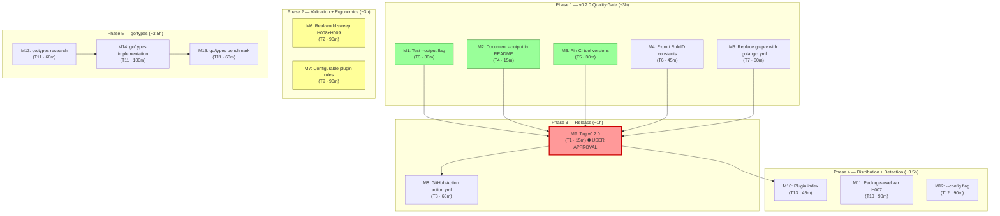

# Road to v0.2.0 Release & Beyond — Pareto Execution Plan

> **Date:** 2026-07-30 23:23
> **Goal:** Close every open TODO_LIST item, ship a clean v0.2.0 tag, and lay the
> groundwork for v0.3+. Every task is verified against code, sized, and dependency-ordered.
> **Source of truth:** `TODO_LIST.md` (T1–T13).

---

## 1. Pareto Breakdown — Where is the leverage?

### Project context

go-humanize-linter is a 9-rule AST linter detecting hand-rolled reimplementations
of `dustin/go-humanize`. The code for v0.2.0 is **shipped to `main` but untagged**.
The project is feature-complete for v0.2.0; what remains is quality, validation,
distribution, and ergonomics work.

### The 1% that delivers 51% of the result (3 tasks · ~45 min total)

These three XS tasks close the v0.2.0 quality gap. Without them, v0.2.0 ships with
an untested flag, an undocumented flag, and non-reproducible CI. They are the gate
between "code-complete" and "releasable."

| Task                                   | Why it's the 1%                                                                                              |
| -------------------------------------- | ------------------------------------------------------------------------------------------------------------ |
| **T3** — Test `--output`/`writeReport` | An untested shipped feature is a liability. Without this, v0.2.0 has a code path with zero regression guard. |
| **T4** — Document `--output` in README | Users can't use a flag they can't discover. This is the difference between "shipped" and "adoptable."        |
| **T5** — Pin CI tool versions          | `@latest` in CI is a ticking time bomb. One upstream breaking change flips CI red with no code change.       |

### The 4% that delivers 64% of the result (6 tasks · ~4 h total)

The above 3 plus three tasks that take the project from "rough but complete" to
"validated and clean":

| Task                                                       | Why it's in the 4%                                                                                     |
| ---------------------------------------------------------- | ------------------------------------------------------------------------------------------------------ |
| **T7** — Replace `grep -v` with `.golangci.yml` plugin reg | The `grep -v` hides real lint signals from every future dev session. Removing it unblocks signal flow. |
| **T6** — Export `RuleIDH001`–`H009` constants              | DRY fix — rule IDs are duplicated across 3 packages. One source of truth prevents drift.               |
| **T2** — Real-world validation sweep H008+H009             | The "~0% FP" quality claim is only verified for 7 of 9 rules. Without this, the claim is dishonest.    |

### The 20% that delivers 80% of the result (9 tasks · ~7 h total)

The above 6 plus adoption and ergonomics:

| Task                                             | Why it's in the 20%                                                                               |
| ------------------------------------------------ | ------------------------------------------------------------------------------------------------- |
| **T8** — GitHub Action composite `action.yml`    | The primary distribution channel for consumers. Without it, adoption requires manual CLI install. |
| **T9** — Configurable rules in plugin mode       | The #1 plugin ergonomics gap. Users can't disable rules from `.golangci.yml`.                     |
| **T1** — Tag `v0.2.0` (blocked on user approval) | THE release gate. Everything above feeds into this.                                               |

### The remaining 20% to get to 100% (4 tasks · ~8 h total)

| Task                                             | Why it's here                                                                                              |
| ------------------------------------------------ | ---------------------------------------------------------------------------------------------------------- |
| **T10** — Package-level `var` detection for H007 | Detection improvement — file-scope multiplier maps are invisible today. Low impact (few real-world hits).  |
| **T11** — go/types type-aware detection          | Large effort, low immediate impact. Aliased imports are rare in practice. Foundation for future precision. |
| **T12** — `--config` flag for YAML/TOML          | Configuration improvement. `--enable`/`--disable` already covers the common case.                          |
| **T13** — Publish to golangci-lint plugin index  | Blocked on T1 + `go-linter-sdk` being publicly installable. Pure distribution.                             |

---

## 2. Comprehensive Plan — Medium Granularity (30–100 min tasks)

All 13 TODO_LIST items broken into 15 scoped tasks. Sorted by
impact/effort/customer-value (Pareto rank).

| #   | Task                                              | TODO | Tier   | Impact | Effort  | Deps  | Phase |
| --- | ------------------------------------------------- | ---- | ------ | ------ | ------- | ----- | ----- |
| M1  | Test `writeReport` — file output path             | T3   | High   | 9      | 30 min  | —     | 1     |
| M2  | Document `--output` flag in README                | T4   | Medium | 7      | 15 min  | —     | 1     |
| M3  | Pin `govulncheck` + `golangci-lint` CI versions   | T5   | High   | 8      | 30 min  | —     | 1     |
| M4  | Export `RuleIDH001`–`H009` constants              | T6   | Medium | 6      | 45 min  | —     | 1     |
| M5  | Replace `grep -v` band-aid with `.golangci.yml`   | T7   | High   | 8      | 60 min  | —     | 1     |
| M6  | Real-world validation sweep (H008 + H009)         | T2   | High   | 8      | 90 min  | —     | 2     |
| M7  | Configurable rules in plugin mode                 | T9   | Medium | 6      | 90 min  | —     | 2     |
| M8  | GitHub Action composite `action.yml`              | T8   | Medium | 6      | 60 min  | T1    | 3     |
| M9  | Tag `v0.2.0` (BLOCKED — requires user approval)   | T1   | Crit   | 10     | 15 min  | M1–M5 | 3     |
| M10 | Publish to golangci-lint plugin index             | T13  | Low    | 4      | 45 min  | M9    | 4     |
| M11 | Package-level `var` detection for H007            | T10  | Low    | 4      | 90 min  | —     | 4     |
| M12 | `--config` flag for YAML/TOML rule configuration  | T12  | Low    | 3      | 90 min  | —     | 4     |
| M13 | go/types type-aware detection — research + design | T11  | Low    | 4      | 60 min  | —     | 5     |
| M14 | go/types type-aware detection — implementation    | T11  | Low    | 4      | 100 min | M13   | 5     |
| M15 | go/types type-aware detection — benchmark + tune  | T11  | Low    | 3      | 60 min  | M14   | 5     |

**Phases:**

- **Phase 1 (M1–M5):** v0.2.0 quality gate — close all gaps before tagging (~3 h)
- **Phase 2 (M6–M7):** Validation + ergonomics (~3 h)
- **Phase 3 (M8–M9):** Release — tag v0.2.0, GitHub Action (~1 h)
- **Phase 4 (M10–M12):** Distribution + detection breadth (~3.5 h)
- **Phase 5 (M13–M15):** go/types foundation (~3.5 h)

**Total estimated effort: ~14 h**

---

## 3. Detailed Breakdown — Fine Granularity (max 12 min per task)

Every medium task split into micro-tasks. Sorted within phase by execution order.

### Phase 1 — v0.2.0 Quality Gate

| #    | Micro-task                                                                   | Parent | Est |
| ---- | ---------------------------------------------------------------------------- | ------ | --- |
| 1.1  | Read `writeReport` in `main.go:146` — understand file-open/close path        | M1     | 3m  |
| 1.2  | `TestWriteReport_TextFile` — write to temp dir, assert content               | M1     | 10m |
| 1.3  | `TestWriteReport_JSONFile` — JSON to file, assert valid JSON                 | M1     | 10m |
| 1.4  | `TestWriteReport_EmptyPath` — empty path = stdout passthrough                | M1     | 5m  |
| 1.5  | `TestWriteReport_CleanupOnError` — failed write leaves no partial file       | M1     | 8m  |
| 1.6  | Run tests, verify green, check coverage delta                                | M1     | 3m  |
| 1.7  | Read README "CLI" section, find insertion point                              | M2     | 2m  |
| 1.8  | Add `--output <file>` example to CLI usage block                             | M2     | 5m  |
| 1.9  | Verify README renders (no broken markdown)                                   | M2     | 2m  |
| 1.10 | Read `ci.yml`, locate `@latest` occurrences (lines 45, 91)                   | M3     | 3m  |
| 1.11 | Find current `govulncheck` stable version (Go module proxy)                  | M3     | 5m  |
| 1.12 | Find current `golangci-lint` stable version (GitHub releases)                | M3     | 5m  |
| 1.13 | Pin both versions in `ci.yml`                                                | M3     | 5m  |
| 1.14 | Verify YAML syntax valid (yq or nix)                                         | M3     | 3m  |
| 1.15 | Read `rules.go` — find where rule IDs live in `allRuleDetectors()`           | M4     | 3m  |
| 1.16 | Read `main.go:216` — find local `h001`–`h009` constants                      | M4     | 3m  |
| 1.17 | Add `RuleIDH001`–`RuleIDH009` exported constants to `rules.go`               | M4     | 10m |
| 1.18 | Replace local constants in `main.go` with imported `humanizelint.RuleIDH0NN` | M4     | 10m |
| 1.19 | Build + lint to verify no goconst regression                                 | M4     | 3m  |
| 1.20 | Read `.golangci.yml` and `flake.nix:160`                                     | M5     | 3m  |
| 1.21 | Research golangci-lint v2 `plugins:` section syntax                          | M5     | 10m |
| 1.22 | Add `plugins:` registration for `gohumanize` to `.golangci.yml`              | M5     | 10m |
| 1.23 | Remove `grep -v` from `flake.nix`                                            | M5     | 3m  |
| 1.24 | Run `nix run .#lint` — verify no "unknown linter" warning                    | M5     | 5m  |

### Phase 2 — Validation + Ergonomics

| #    | Micro-task                                                            | Parent | Est |
| ---- | --------------------------------------------------------------------- | ------ | --- |
| 2.1  | Build linter binary (`nix run .#build`)                               | M6     | 3m  |
| 2.2  | Run over `~/projects/` corpus with all 9 rules enabled                | M6     | 10m |
| 2.3  | Collect H008/H009 finding counts                                      | M6     | 5m  |
| 2.4  | Triage false positives in H008/H009 results                           | M6     | 10m |
| 2.5  | Write results to `docs/validation/2026-07-30_v0.2-sweep.md`           | M6     | 10m |
| 2.6  | Read `plugin/plugin.go` — `newAnalyzer()` (line 40), understand Flags | M7     | 3m  |
| 2.7  | Add `Flags: flag.NewFlagSet(...)` with `enable`/`disable` strings     | M7     | 10m |
| 2.8  | Parse flags in `analyzeHumanize` — split on comma, build filter set   | M7     | 10m |
| 2.9  | Filter `DetectFuncDecl` results by enabled/disabled set               | M7     | 10m |
| 2.10 | Add `TestAnalyzer_EnableDisable` — verify flag filtering works        | M7     | 10m |
| 2.11 | Build + race test + lint                                              | M7     | 5m  |

### Phase 3 — Release

| #   | Micro-task                                                           | Parent | Est |
| --- | -------------------------------------------------------------------- | ------ | --- |
| 3.1 | Verify CHANGELOG `[0.2.0]` matches shipped features                  | M9     | 5m  |
| 3.2 | Verify `go build ./... && go test ./... -race && go vet ./...` green | M9     | 5m  |
| 3.3 | `git tag v0.2.0` (BLOCKED — requires explicit user approval)         | M9     | 2m  |
| 3.4 | `git push origin v0.2.0`, verify release workflow fires              | M9     | 5m  |
| 3.5 | Research GitHub composite action format (inputs, runs, steps)        | M8     | 10m |
| 3.6 | Create `action.yml` with inputs: path, enable, disable, format       | M8     | 10m |
| 3.7 | Add "Use in GitHub Actions" section to README                        | M8     | 10m |
| 3.8 | Test action.yml locally (act or dry-run validation)                  | M8     | 10m |

### Phase 4 — Distribution + Detection Breadth

| #    | Micro-task                                                            | Parent | Est |
| ---- | --------------------------------------------------------------------- | ------ | --- |
| 4.1  | Research golangci-lint plugin index submission format                 | M10    | 5m  |
| 4.2  | Prepare plugin metadata (name, import path, description)              | M10    | 5m  |
| 4.3  | Submit PR to plugin index repo                                        | M10    | 10m |
| 4.4  | Read `walker.go` `checkFuncDecls` — understand decl iteration loop    | M11    | 5m  |
| 4.5  | Read `pattern_parsebytes.go` — `hasByteUnitMultiplierMap` detector    | M11    | 5m  |
| 4.6  | Add `scanPackageVars` — iterate `*ast.GenDecl` for `map[string]int64` | M11    | 10m |
| 4.7  | Wire into `checkFuncDecls` as a separate pass before func iteration   | M11    | 10m |
| 4.8  | Create `testdata/h007_package_var/main.go` fixture                    | M11    | 8m  |
| 4.9  | Add `TestRuleParseBytes_PackageVar` test case                         | M11    | 8m  |
| 4.10 | Build + test + lint                                                   | M11    | 5m  |
| 4.11 | Define `Config` struct schema (Enabled, Disabled, Thresholds)         | M12    | 10m |
| 4.12 | Write `loadConfig(path)` — YAML unmarshal + validation                | M12    | 10m |
| 4.13 | Wire `--config` flag in `main.go`, apply precedence over CLI flags    | M12    | 10m |
| 4.14 | `TestLoadConfig` — valid, invalid, missing, precedence                | M12    | 10m |

### Phase 5 — go/types Foundation

| #    | Micro-task                                                                 | Parent | Est |
| ---- | -------------------------------------------------------------------------- | ------ | --- |
| 5.1  | Research `pass.TypesInfo` usage in `go/analysis` analyzers                 | M13    | 10m |
| 5.2  | Prototype `isPackageCallTypes` — resolve alias via `TypesInfo.Uses`        | M13    | 12m |
| 5.3  | Assess: full `go/types` vs `pass.TypesInfo` only (plugin vs CLI)           | M13    | 10m |
| 5.4  | Write design decision doc in `docs/adr/0001-types-aware-detection.md`      | M13    | 10m |
| 5.5  | Implement `resolveImportAlias` in `pattern_helpers.go`                     | M14    | 12m |
| 5.6  | Update `isPackageCall` to use type info when available                     | M14    | 10m |
| 5.7  | Update all `rule_*.go` detectors to pass type info                         | M14    | 10m |
| 5.8  | Add aliased-import testdata fixtures (`testdata/h001_alias/`)              | M14    | 10m |
| 5.9  | Add `TestIsPackageCall_Aliased` — `f "fmt"`, `s "strings"`                 | M14    | 10m |
| 5.10 | Build + test + lint                                                        | M14    | 5m  |
| 5.11 | Write `BenchmarkIsPackageCall_Syntactic` vs `BenchmarkIsPackageCall_Types` | M15    | 10m |
| 5.12 | Run benchmarks, compare with `benchstat`                                   | M15    | 10m |
| 5.13 | Optimize hot path if >10% regression                                       | M15    | 12m |
| 5.14 | Document findings in ADR                                                   | M15    | 5m  |

---

## 4. Execution Graph

**Critical path:** M1 → M9 (tag v0.2.0) → M8 (GitHub Action) → M10 (plugin index)

**Parallel tracks (no dependencies, can run concurrently):**

- M6 (validation sweep) — independent of all phases
- M7 (configurable plugin) — independent of all phases
- M11 (package-level var) — independent
- M12 (--config flag) — independent
- M13→M14→M15 (go/types) — independent chain

---

## 5. What is NOT in this plan

Deliberately excluded (these are ROADMAP items, not TODO_LIST):

- **Per-line diagnostics** (ROADMAP) — requires every detector to return specific `token.Pos`. Large architectural change, post-v1.0.
- **Auto-fix** (ROADMAP) — rewrite detected code via `go-finding` `FixEngine`. Post-v1.0.
- **LSP server mode** (ROADMAP) — editor integration. Post-v1.0.
- **H010+ new rules** (ROADMAP) — more `go-humanize` coverage candidates.
- **H009/H002 overlap disambiguation** (ROADMAP) — design smell noted; needs a signal H002 can't match. Post-v0.3.0.
- **Multi-language / ML / SaaS** (ROADMAP non-goals) — explicitly out of scope.

---

## 6. Success Criteria

- [ ] v0.2.0 tagged and release workflow fires
- [ ] All 9 rules validated against 190+ project corpus (H008/H009 FP rate documented)
- [ ] `--output` flag tested and documented
- [ ] CI versions pinned (reproducible)
- [ ] `grep -v` band-aid removed; `.golangci.yml` plugin registration works
- [ ] `RuleIDH001`–`H009` exported; no duplication across packages
- [ ] GitHub Action composite published
- [ ] Plugin rules configurable from `.golangci.yml`
- [ ] `go test ./... -race` green
- [ ] `nix run .#lint` 0 issues
