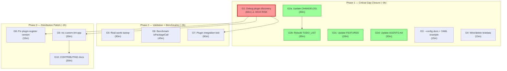

# Gap Closure Plan — Post-Pareto Session Fixes

> **Date:** 2026-07-31 03:48
> **Trigger:** Status report `2026-07-31_03-48_pareto-plan-execution-and-honest-gaps.md`
> **Goal:** Close ALL documentation gaps, verify the plugin registration, and prepare for v0.2.0 tag.

---

## 1. Pareto Breakdown

### The 1% that delivers 51% (2 tasks · ~30 min)

| Task                                                         | Why                                                                                                                                                                                                   |
| ------------------------------------------------------------ | ----------------------------------------------------------------------------------------------------------------------------------------------------------------------------------------------------- |
| **G1** — Debug golangci-lint v2 module plugin discovery      | The single biggest risk: M5+M7 are "code complete" but never verified through the actual golangci-lint runtime. If this doesn't work, the entire plugin configurable-rules feature is non-functional. |
| **G2** — Update CHANGELOG + TODO_LIST + FEATURES + AGENTS.md | 4 living docs are stale right now. This is the trophy-case anti-pattern repeated. Without these updates, the next session starts from a false picture of reality.                                     |

### The 4% that delivers 64% (4 tasks · ~1 h)

The above 2 plus:

| Task                                                                    | Why                                                                                                           |
| ----------------------------------------------------------------------- | ------------------------------------------------------------------------------------------------------------- |
| **G3** — Add `--config` to main.go doc comment + YAML example in README | Users can't discover the flag from `--help` or the docs. Quick fix, high adoption impact.                     |
| **G4** — Wire `testdata/h001_suppressed/` into a test or delete it      | It's been sitting untracked since the session start. Either it's useful (wire it) or dead weight (remove it). |

### The 20% that delivers 80% (7 tasks · ~3 h)

The above 4 plus:

| Task                                                                  | Why                                                                 |
| --------------------------------------------------------------------- | ------------------------------------------------------------------- |
| **G5** — Run real-world validation sweep (M6)                         | The "~0% FP" claim is unverified for H008/H009 + all new detection. |
| **G6** — Write benchmark for import-alias-aware `isPackageCall` (M15) | No perf data exists. Need to confirm no regression.                 |
| **G7** — Add integration test for plugin through golangci-lint        | Unit tests aren't enough for a runtime-discovery system.            |

### The remaining 20% (distribution + polish)

| Task                                                       | Why                     |
| ---------------------------------------------------------- | ----------------------- |
| **G8** — Pin `plugin-module-register` in `.custom-gcl.yml` | Reproducibility         |
| **G9** — Add `nix run .#custom-lint` to flake.nix          | Dev workflow automation |
| **G10** — Document custom-gcl workflow in CONTRIBUTING.md  | Contributor onboarding  |

---

## 2. Medium-Granularity Plan (30–100 min tasks)

| #   | Task                                                 | Deps  | Effort | Phase |
| --- | ---------------------------------------------------- | ----- | ------ | ----- |
| G1  | Debug golangci-lint v2 module plugin discovery       | —     | 60 min | 1     |
| G2a | Update CHANGELOG.md with all new features            | —     | 30 min | 1     |
| G2b | Rebuild TODO_LIST.md (mark done items, harvest new)  | G2a   | 30 min | 1     |
| G2c | Update FEATURES.md with new capabilities + coverage  | —     | 30 min | 1     |
| G2d | Update AGENTS.md architecture table + gotchas        | —     | 30 min | 1     |
| G3  | Add `--config` to doc comment + YAML example in docs | —     | 15 min | 1     |
| G4  | Wire or delete `testdata/h001_suppressed/`           | —     | 15 min | 1     |
| G5  | Real-world validation sweep                          | —     | 90 min | 2     |
| G6  | Benchmark import-alias-aware isPackageCall           | —     | 45 min | 2     |
| G7  | Integration test for plugin through golangci-lint    | G1    | 60 min | 2     |
| G8  | Pin plugin-module-register in .custom-gcl.yml        | G1    | 15 min | 3     |
| G9  | Add `nix run .#custom-lint` to flake.nix             | G1    | 30 min | 3     |
| G10 | Document custom-gcl in CONTRIBUTING.md               | G1,G9 | 30 min | 3     |

---

## 3. Execution Graph

**Critical path:** G1 (debug plugin) → G7 (integration test) → tag v0.2.0

---

## 4. What is NOT in this plan

- Tagging v0.2.0 (blocked on user approval + G1 verified)
- Full go/types integration (ADR 0001 deferred this)
- H009/H002 overlap disambiguation (ROADMAP)
- New rules H010+ (ROADMAP)
- Auto-fix / LSP server (ROADMAP)
