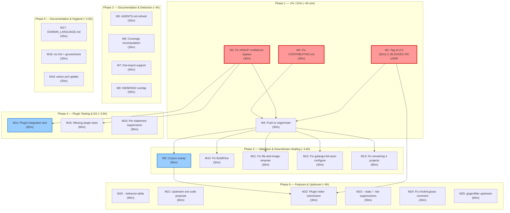

# Pareto Plan — 2026-08-05 06:33 — Road to v0.2.0 Release & Beyond

> **Trigger:** User request for comprehensive Pareto-planning of all open TODOs.
> **Input:** `TODO_LIST.md` (10 open items), `ROADMAP.md` (5 themes), status reports' forward-looking lists.
> **Goal:** Identify the 1% / 4% / 20% that deliver 51% / 64% / 80% of value, then produce an execution-ready plan.
> **Method:** READ → UNDERSTAND → RESEARCH → REFLECT → BREAK DOWN → SORT → VERIFY.

---

## 1. Pareto Breakdown

### The 1% that delivers 51% (3 tasks · ~45 min total)

These three items are XS effort but block adoption, break correctness, or block every new contributor. Doing **only these three** transforms the project from "code exists locally" to "released, correct, and onboarding-ready."

| #   | Task                                         | Why it's the 1%                                                                                                         | Effort | Blocks                          |
| --- | -------------------------------------------- | ----------------------------------------------------------------------------------------------------------------------- | ------ | ------------------------------- |
| P1  | **Tag `v0.2.0`** (TODO T1)                   | Code shipped, CHANGELOG written, tests pass. Only the tag is missing. Unblocks plugin index, `go install`, release notes | XS     | T18, downstream adoption, CI    |
| P2  | **Fix H0SUP confidence bypass** (TODO T23)   | Known correctness bug: `minConfidence: full` silently hides all suppression-verification diagnostics. XS one-line fix   | XS     | None (pure correctness)         |
| P3  | **Fix CONTRIBUTING.md env vars**             | Every new contributor following the docs hits cryptic `GOEXPERIMENT` errors. 14-line file, trivial fix                  | XS     | All contributor onboarding      |

### The 4% that delivers 64% (add 4 tasks · ~4h total)

The above 3 plus these 4 transform the project from "released but unverified" to "validated, integrated, and healing downstream damage."

| #   | Task                                                    | Why it's the 4%                                                                                                | Effort | Blocks                              |
| --- | ------------------------------------------------------- | ------------------------------------------------------------------------------------------------------------- | ------ | ----------------------------------- |
| P4  | **Corpus validation sweep** (TODO T2)                   | The "~0% FP" claim doesn't cover new features (`--verify-suppressions`, `--min-confidence`, gogenfilter)     | M      | Confidence in product, marketing    |
| P5  | **Fix 7 broken downstream projects**                    | Active bleeding: BuildFlow won't compile, file-and-image-renamer has wrong `//nolint`, etc.                  | M      | 7 projects' CI, trust in linter     |
| P6  | **Plugin integration test through `custom-gcl`** (T15)  | The plugin runtime (90% of users) has NEVER been tested end-to-end through golangci-lint. Only unit tests     | S      | Confidence in primary distribution  |
| P7  | **Push to origin/main**                                 | ~15+ commits unpushed. All work is invisible to CI/teammates/downstream                                      | XS     | CI, downstream visibility           |

### The 20% that delivers 80% (add 8 tasks · ~12h total)

The above 7 plus these 8 close all detection gaps, improve DX, and bring documentation to full health.

| #   | Task                                              | Why it's the 20%                                                                        | Effort |
| --- | ------------------------------------------------- | --------------------------------------------------------------------------------------- | ------ |
| P8  | **Dot-import support** (TODO T16)                | Detection recall gap: `. "strings"` bypasses all pattern helpers                       | S      |
| P9  | **H009/H002 overlap disambiguation** (TODO T17)  | Double diagnostics for one mistake — noisy UX                                           | M      |
| P10 | **Per-statement suppression** (TODO T19)         | Users can only suppress whole functions; line-level is the expected DX                  | M      |
| P11 | **AGENTS.md + living docs refresh**              | Every AI session reads stale AGENTS.md (coverage numbers, missing panic guard gotcha)  | S      |
| P12 | **Missing plugin tests** (3 integration tests)   | `TestRunDetector_FiltersByConfidence`, `_VerifySuppressions`, `_H0SUPBypass`            | S      |
| P13 | **`docs/DOMAIN_LANGUAGE.md`** creation           | Glossary of rule IDs, "corroborating signals", "ghost rule" — contributor onboarding    | S      |
| P14 | **Hygiene: `nix fmt` + `govulncheck` + `go mod verify`** | Compliance and security after gogenfilter added 5+ transitive deps               | S      |
| P15 | **Coverage recomputation**                        | FEATURES.md numbers are 1 measurement old; need `nix run .#coverage` baseline          | XS     |

### The remaining 20% (add 10+ tasks · ongoing)

Everything else — features, architecture, polish, upstream contributions. These deliver diminishing returns and belong after the 80% is locked.

| #    | Task                                                       | Category      | Effort |
| ---- | ---------------------------------------------------------- | ------------- | ------ |
| P16  | `--behavior-delta` flag (TODO T20)                        | Feature       | M      |
| P17  | Propose `ExitCodeFromReportConfidence` upstream (T21)     | Upstream      | S      |
| P18  | Publish to golangci-lint plugin index (T18, blocked on P1)| Distribution  | S      |
| P19  | `action.yml` update (add `min-confidence`, `verify-suppressions` inputs) | Distribution | XS     |
| P20  | `--stats` / `--list-suppressions` / `--verify-config` modes | Polish      | M      |
| P21  | Fix dishonest `//nolint:gosec` comment in `walker.go`     | Code quality  | XS     |
| P22  | Contribute `_gen.go`/`.gen.go` patterns to gogenfilter    | Upstream      | S      |
| P23  | Per-line diagnostics (detectors return `token.Pos`)       | Architecture  | L      |
| P24  | Type-aware detection (`go/types` integration)             | Architecture  | L      |
| P25  | Auto-fix via `go-finding` `FixEngine`                      | Architecture  | L      |

---

## 2. Comprehensive Plan — Medium Granularity (30-100 min tasks)

Sorted by `Impact × Value ÷ Effort` (descending). Each task is independently estimable and bounded. Phases reflect dependency ordering.

| #    | Task                                                                         | Phase | Effort  | Impact | Depends on |
| ---- | ---------------------------------------------------------------------------- | ----- | ------- | ------ | ---------- |
| M1   | Tag `v0.2.0` on `main` + verify release workflow fires (P1)                | 1     | 30 min  | 10     | User OK    |
| M2   | Fix H0SUP confidence bypass in `runDetector` + test (P2, T23)              | 1     | 30 min  | 8      | —          |
| M3   | Fix CONTRIBUTING.md: env vars, rule-addition checklist (P3)                | 1     | 30 min  | 7      | —          |
| M4   | Push all commits to origin/main (P7)                                        | 1     | 30 min  | 8      | M1-M3      |
| M5   | AGENTS.md refresh: panic guard gotcha, coverage, RunOverPackage removal     | 2     | 45 min  | 6      | —          |
| M6   | Coverage recomputation via `nix run .#coverage` + update FEATURES.md (P15)  | 2     | 30 min  | 5      | —          |
| M7   | Dot-import support in `buildImportAliases` + pattern helpers (P8, T16)      | 2     | 60 min  | 6      | —          |
| M8   | H009/H002 overlap: suppress H002 when H009 fires + test (P9, T17)           | 2     | 90 min  | 5      | —          |
| M9   | Corpus sweep: 327 projects, all 9 rules + new features (P4, T2)             | 3     | 90 min  | 9      | M4         |
| M10  | Fix BuildFlow: apply `english.PluralWord` suggestion                         | 3     | 30 min  | 6      | M4         |
| M11  | Fix file-and-image-renamer: correct `//nolint` directive                     | 3     | 30 min  | 5      | M4         |
| M12  | Fix golangci-lint-auto-configure: H004 finding using correct API            | 3     | 30 min  | 5      | M4         |
| M13  | Fix remaining 4 broken downstream projects (P5)                              | 3     | 90 min  | 5      | M4         |
| M14  | Plugin integration test: build `custom-gcl`, run on testdata (P6, T15)       | 4     | 60 min  | 7      | M2         |
| M15  | `TestRunDetector_FiltersByConfidence` + `_VerifySuppressions` (P12)         | 4     | 60 min  | 6      | M2         |
| M16  | Per-statement suppression: decide approach + implement (P10, T19)            | 4     | 90 min  | 6      | —          |
| M17  | `docs/DOMAIN_LANGUAGE.md` creation (P13)                                     | 5     | 45 min  | 4      | —          |
| M18  | Hygiene: `nix fmt` + `govulncheck` + `go mod verify` (P14)                  | 5     | 30 min  | 4      | —          |
| M19  | `action.yml`: add `min-confidence` + `verify-suppressions` inputs (P19)      | 5     | 30 min  | 4      | —          |
| M20  | `--behavior-delta` baseline comparison flag (P16, T20)                       | 6     | 90 min  | 3      | —          |
| M21  | Propose `ExitCodeFromReportConfidence` upstream (P17, T21)                  | 6     | 60 min  | 3      | —          |
| M22  | Publish to golangci-lint plugin index (P18, T18)                             | 6     | 30 min  | 4      | M1         |
| M23  | Polish: `--stats` / `--list-suppressions` / `--verify-config` (P20)         | 6     | 90 min  | 3      | —          |
| M24  | Fix dishonest `//nolint:gosec` comment + scope walker (P21)                 | 6     | 30 min  | 3      | —          |
| M25  | Contribute `_gen.go`/`.gen.go` to gogenfilter upstream (P22)                | 6     | 60 min  | 2      | —          |

**Total: 25 tasks · ~20.5 hours**

---

## 3. Detailed Breakdown — Fine Granularity (≤12 min tasks)

Each medium task decomposed into atomic subtasks. Sorted within each medium task by execution order.

| #     | Subtask                                                                       | Parent | Effort |
| ----- | ----------------------------------------------------------------------------- | ------ | ------ |
| F1    | Confirm user approval for v0.2.0 tag                                          | M1     | 2 min  |
| F2    | `git tag v0.2.0`                                                              | M1     | 2 min  |
| F3    | Push tag: `git push origin v0.2.0`                                            | M1     | 2 min  |
| F4    | Verify release workflow fires on GitHub Actions                               | M1     | 5 min  |
| F5    | Verify `go install ...@v0.2.0` works                                          | M1     | 5 min  |
| F6    | Publish GitHub Release notes from CHANGELOG                                   | M1     | 10 min |
| F7    | Read `runDetector` confidence filter logic (`plugin/plugin.go`)               | M2     | 5 min  |
| F8    | Add H0SUP exclusion: `if f.RuleID == "H0SUP" { continue }` bypass             | M2     | 5 min  |
| F9    | Add `TestRunDetector_H0SUPBypassesConfidenceFilter`                           | M2     | 10 min |
| F10   | Run tests + lint                                                              | M2     | 3 min  |
| F11   | Read current CONTRIBUTING.md                                                  | M3     | 3 min  |
| F12   | Add `GOEXPERIMENT=jsonv2` + `GOPRIVATE` env vars to all commands              | M3     | 5 min  |
| F13   | Add rule-addition checklist (11 steps from prior audit)                       | M3     | 10 min |
| F14   | Add CLI-flag checklist                                                         | M3     | 5 min  |
| F15   | Run lint to verify no issues                                                   | M3     | 2 min  |
| F16   | `git status` — confirm working tree state                                      | M4     | 2 min  |
| F17   | `git push origin main`                                                         | M4     | 5 min  |
| F18   | Verify CI passes on origin                                                     | M4     | 5 min  |
| F19   | Read AGENTS.md architecture table + gotchas                                    | M5     | 5 min  |
| F20   | Remove any RunOverPackage references                                           | M5     | 3 min  |
| F21   | Add `findingToTokenPos` panic guard to gotchas                                 | M5     | 5 min  |
| F22   | Update coverage numbers if hardcoded                                           | M5     | 5 min  |
| F23   | Add H0SUP confidence bypass to gotchas                                         | M5     | 5 min  |
| F24   | Verify all referenced paths exist                                              | M5     | 5 min  |
| F25   | Run `nix run .#coverage`                                                       | M6     | 10 min |
| F26   | Compare numbers against FEATURES.md                                            | M6     | 3 min  |
| F27   | Update FEATURES.md coverage table                                              | M6     | 5 min  |
| F28   | Update CHANGELOG coverage line                                                 | M6     | 3 min  |
| F29   | Read `buildImportAliases` current implementation                               | M7     | 5 min  |
| F30   | Add dot-import detection: `. "strings"` → alias key `.`                        | M7     | 10 min |
| F31   | Handle bare calls in `isPackageCall` when alias is `.`                          | M7     | 10 min |
| F32   | Thread through pattern helpers (`HasSuffix`, `TrimRight`, etc.)                | M7     | 10 min |
| F33   | Add testdata: `testdata/h007_dot_import/main.go`                               | M7     | 10 min |
| F34   | Add test: `TestRuleParseBytes_DotImport`                                        | M7     | 10 min |
| F35   | Run tests + lint                                                               | M7     | 3 min  |
| F36   | Read H009 and H002 detectors to understand overlap                             | M8     | 5 min  |
| F37   | Design disambiguation: H009 requires `FormatFloat` or dot-split signal         | M8     | 10 min |
| F38   | Add `hasFormatFloatSpecificSignal` helper                                       | M8     | 10 min |
| F39   | Suppress H002 when H009 fires on same function                                  | M8     | 10 min |
| F40   | Add test: `TestH009H002_NoOverlap`                                              | M8     | 10 min |
| F41   | Add testdata fixture triggering only H009 (not H002)                            | M8     | 10 min |
| F42   | Run tests + lint                                                               | M8     | 3 min  |
| F43   | Build CLI binary: `go build -o /tmp/gohumanize ./cmd/go-humanize-linter`       | M9     | 5 min  |
| F44   | Run all 9 rules over `~/projects/` corpus                                      | M9     | 30 min |
| F45   | Run `--verify-suppressions` over corpus, record stale-directive rate           | M9     | 15 min |
| F46   | Run `--min-confidence high` over corpus, compare counts                        | M9     | 15 min |
| F47   | Manually inspect sample of findings for FP rate                                | M9     | 15 min |
| F48   | Save results to `docs/validation/2026-08-05_real-world-sweep.md`               | M9     | 10 min |
| F49   | Update FEATURES.md validation section                                          | M9     | 5 min  |
| F50   | Read BuildFlow `execution/plural.go`                                            | M10    | 5 min  |
| F51   | Apply `english.PluralWord` fix                                                  | M10    | 10 min |
| F52   | Verify BuildFlow compiles + tests pass                                         | M10    | 10 min |
| F53   | Commit + push BuildFlow fix                                                    | M10    | 5 min  |
| F54   | Read file-and-image-renamer `//nolint` directive                                | M11    | 5 min  |
| F55   | Fix: `//nolint:go-humanize-linter/H003` → `//nolint:gohumanize:H003`           | M11    | 5 min  |
| F56   | Run `--verify-suppressions` to confirm fix                                     | M11    | 5 min  |
| F57   | Commit + push                                                                  | M11    | 5 min  |
| F58   | Read golangci-lint-auto-configure H004 finding                                 | M12    | 5 min  |
| F59   | Apply `english.PluralWord` suggestion                                           | M12    | 10 min |
| F60   | Verify compiles + linter produces 0 findings                                   | M12    | 10 min |
| F61   | Commit + push                                                                  | M12    | 5 min  |
| F62   | Fix auto-deduplicate (pre-existing build errors + humanize import)             | M13    | 30 min |
| F63   | Fix invoices (depguard config + 50+ false positives)                           | M13    | 30 min |
| F64   | Fix mr-sync (3 unpushed commits + vendorHash)                                  | M13    | 15 min |
| F65   | Fix emeet-pixyd (uncommitted vendorHash)                                       | M13    | 10 min |
| F66   | Build `custom-gcl` via `golangci-lint custom`                                  | M14    | 15 min |
| F67   | Create test project with humanize reimplementations + `//nolint`               | M14    | 15 min |
| F68   | Run `custom-gcl` with `minConfidence: medium`, verify filtering                | M14    | 10 min |
| F69   | Run `custom-gcl` with `verifySuppressions: true`, verify H0SUP                 | M14    | 10 min |
| F70   | Verify diagnostics at finding position (not func decl)                         | M14    | 10 min |
| F71   | Write `TestRunDetector_FiltersByConfidence` via analysistest                   | M15    | 30 min |
| F72   | Write `TestRunDetector_VerifySuppressions` via analysistest                    | M15    | 30 min |
| F73   | Read current suppression matching (`pattern_helpers.go`)                       | M16    | 10 min |
| F74   | Decide: per-statement `token.Pos` vs line-range matching                       | M16    | 10 min |
| F75   | Update one detector (H001) to return statement-level `token.Pos`               | M16    | 30 min |
| F76   | Update suppression matcher to handle per-statement directives                  | M16    | 30 min |
| F77   | Add testdata: `testdata/h001_per_statement_suppression/`                       | M16    | 10 min |
| F78   | Add test: `TestPerStatementSuppression`                                         | M16    | 10 min |
| F79   | Extract domain terms from code (rule IDs, signals, "ghost rule")              | M17    | 15 min |
| F80   | Write `docs/DOMAIN_LANGUAGE.md` glossary                                        | M17    | 30 min |
| F81   | Verify terms still used in codebase                                             | M17    | 5 min  |
| F82   | Run `nix fmt` (treefmt: gofumpt, goimports, golines)                           | M18    | 10 min |
| F83   | Run `govulncheck ./...` on new transitive deps                                  | M18    | 10 min |
| F84   | Run `go mod verify`                                                             | M18    | 5 min  |
| F85   | Audit `segmentio/asm` — is it runtime-used or dead weight?                     | M18    | 10 min |
| F86   | Read current `action.yml`                                                       | M19    | 5 min  |
| F87   | Add `min_confidence` input                                                      | M19    | 10 min |
| F88   | Add `verify_suppressions` input                                                 | M19    | 10 min |
| F89   | Test action locally with `act` or dry-run                                       | M19    | 10 min |
| F90   | Design baseline JSON format for `--behavior-delta`                              | M20    | 15 min |
| F91   | Implement baseline loader (`loadBaseline(path)`)                                | M20    | 30 min |
| F92   | Implement comparison: report added + removed findings                           | M20    | 30 min |
| F93   | Implement exit code: 0 = no delta, 1 = delta                                    | M20    | 10 min |
| F94   | Add `TestBehaviorDelta_NoDelta` + `TestBehaviorDelta_AddedFinding`              | M20    | 15 min |
| F95   | Draft PR description for `go-linter-sdk`                                        | M21    | 15 min |
| F96   | Implement `ExitCodeFromReportConfidence(report, minConfidence)`                 | M21    | 30 min |
| F97   | Add tests in go-linter-sdk                                                       | M21    | 15 min |
| F98   | Open PR                                                                         | M21    | 10 min |
| F99   | Read golangci-lint plugin index submission requirements                         | M22    | 10 min |
| F100  | Prepare submission (README, install instructions)                               | M22    | 15 min |
| F101  | Submit to plugin index                                                          | M22    | 5 min  |
| F102  | Design `--stats` output format (rule, count, confidence distribution)           | M23    | 10 min |
| F103  | Implement `--stats` mode                                                         | M23    | 30 min |
| F104  | Implement `--list-suppressions` mode                                            | M23    | 15 min |
| F105  | Implement `--verify-config` mode                                                | M23    | 30 min |
| F106  | Read `walker.go` `//nolint:gosec` comment + function signature                  | M24    | 5 min  |
| F107  | Rewrite comment to admit trust model (public API defers to caller)              | M24    | 10 min |
| F108  | Consider `WalkTrustedDir` unexported variant                                    | M24    | 10 min |
| F109  | Read gogenfilter source for generator table structure                            | M25    | 10 min |
| F110  | Write PR adding `_gen.go` / `.gen.go` patterns                                   | M25    | 30 min |
| F111  | Add tests in gogenfilter                                                         | M25    | 15 min |
| F112  | Open PR to gogenfilter                                                          | M25    | 5 min  |

**Total: 112 atomic subtasks.**

---

## 4. Execution Graph

**Critical path:** M1 (tag) → M4 (push) → M9 (corpus sweep) → M22 (plugin index).
**Highest-risk:** M16 (per-statement suppression) — touches every detector.
**Highest-leverage:** M1+M2+M3 (the 1%).

---

## 5. What is NOT in this plan

- **Per-line diagnostics** (ROADMAP) — requires every detector to return specific `token.Pos`. Architectural change, L effort. Defer to post-v1.0.
- **Type-aware detection** (`go/types`) — ROADMAP item, L effort. ADR 0001 documents the deferral.
- **Auto-fix** (`FixEngine`) — ROADMAP item, L effort. Requires careful output-change analysis (SI vs IEC).
- **LSP server mode** — ROADMAP item, L effort. Out of scope for v0.2.x.
- **H010+ new rules** — ROADMAP item. No urgency; corpus sweep (M9) will reveal which `go-humanize` functions are most reimplemented.
- **Multi-language support** — Non-goal per ROADMAP.
- **ML-based scoring** — Non-goal per ROADMAP.
- **Hosted/SaaS** — Non-goal per ROADMAP.

---

## 6. Risk Assessment

| Risk                                                              | Probability | Impact | Mitigation                                                                  |
| ----------------------------------------------------------------- | ----------- | ------ | --------------------------------------------------------------------------- |
| User does not approve v0.2.0 tag (M1 blocked)                     | Medium      | High   | All Phase 3+ work proceeds without the tag; plugin index (M22) deferred     |
| Corpus sweep reveals new false positives                          | Medium      | Medium | Fix before tagging; adjust confidence levels if needed                      |
| Downstream projects have deeper issues than expected               | Low         | Medium | Time-box each fix at 30 min; escalate if blocked                            |
| Per-statement suppression (M16) breaks existing suppression tests  | Low         | High   | Run full test suite after each detector change; feature-flag if needed      |
| `custom-gcl` build fails (network, git clone issues)               | Medium      | Low    | Gate behind `testing.Short()`; document manual workaround                   |
| gogenfilter upstream PR rejected                                  | Low         | Low    | Legacy fallback remains; no functional impact                               |

---

## 7. Success Criteria

After executing Phases 1-5 (the 80%), the project should be:

- [ ] **Released:** `v0.2.0` tagged, release notes published, `go install` works
- [ ] **Correct:** H0SUP bypasses confidence filtering (M2)
- [ ] **Validated:** 327-project corpus sweep documented, ~0% FP confirmed for new features
- [ ] **Healing:** 7 downstream projects fixed and compiling
- [ ] **Tested:** Plugin runtime tested end-to-end through `custom-gcl`
- [ ] **Documented:** AGENTS.md, CONTRIBUTING.md, DOMAIN_LANGUAGE.md all current
- [ ] **Clean:** `nix fmt`, `govulncheck`, `go mod verify` all pass
- [ ] **Pushed:** All work visible on origin/main with passing CI
