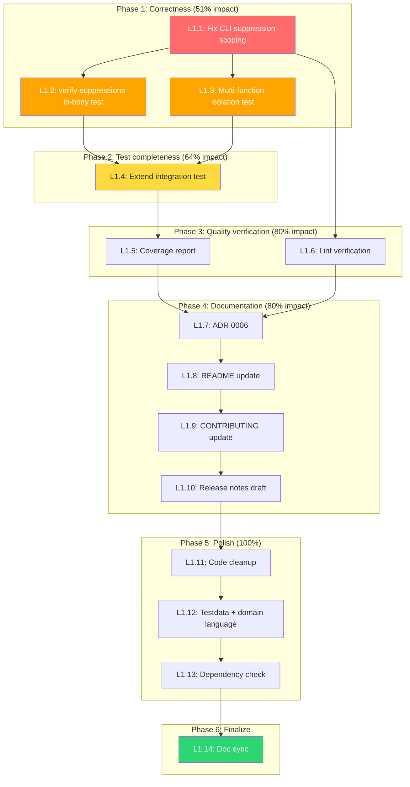

# Planning — 2026-08-08 Road to v0.2.0 Release & Hardening

_Created: 2026-08-08 10:55_
_Context: Post-T19/T15/T20 session. T19 (in-body suppression) and T15 (integration test) shipped. This plan covers everything remaining._

---

## Executive Summary

The project is **code-complete for v0.2.0** but has one correctness bug (CLI suppression scoping), several test gaps around the newly shipped in-body suppression feature, and is blocked on a git tag for release. This plan addresses all actionable items.

---

## Pareto Analysis

### The 1% that delivers 51% of the result

| # | Task | Why |
|---|------|-----|
| **P1** | **Fix CLI suppression scoping bug** | The CLI path (`hasNoLintDirective`) ignores per-rule scoping. `//nolint:gohumanize:H002` suppresses ALL rules in CLI but suppresses NOTHING in plugin. This is a silent correctness divergence between the two execution paths. One function change, massive trust impact. |

### The 4% that delivers 64% of the result

| # | Task | Why |
|---|------|-----|
| **P1** | Fix CLI suppression scoping bug | (above) |
| **P2** | Add `--verify-suppressions` in-body directive test | The feature I just shipped (in-body `//nolint`) has NO test verifying the verification path handles it correctly. An in-body directive could be falsely reported as stale. |
| **P3** | Add multi-function isolation test | No test verifies that an in-body `//nolint` in function A does NOT suppress findings in sibling function B in the same file. This is a correctness-critical isolation test. |

### The 20% that delivers 80% of the result

| # | Task | Why |
|---|------|-----|
| **P1-P3** | (above) | Core correctness |
| **P4** | Extend integration test (`minConfidence` + `verifySuppressions`) | T15 asked for this; I only tested basic detection. |
| **P5** | Run coverage + lint verification | Verify the shipped code is actually covered and clean. |
| **P6** | ADR 0006: Per-statement suppression design decision | Document why line-range matching was chosen, when to upgrade to Approach A. |
| **P7** | README: Document in-body `//nolint` support | Users need to know this feature exists. |
| **P8** | CONTRIBUTING.md: Document suppression behavior | Contributors need to know how suppression works. |
| **P9** | Release notes draft for v0.2.0 | Prepare for T1 (tagging). |

### The remaining 20% (to reach 100%)

| # | Task | Why |
|---|------|-----|
| **P10** | `fnLine` cleanup in `extractFunctionSuppressions` | Minor code clarity. |
| **P11** | Standalone-line in-body testdata fixture | Test coverage completeness. |
| **P12** | `docs/DOMAIN_LANGUAGE.md` update | Terminology consistency. |
| **P13** | `directiveMatchesFinding` future-proofing comment | Prevents future breakage. |
| **P14** | Dependency version check | Maintenance hygiene. |

### Not in this plan (blocked / external)

| Task | Blocker |
|------|---------|
| T1: Tag v0.2.0 | Needs explicit user approval |
| T2: 327-project corpus sweep | Needs corpus on disk |
| T18: Plugin index submission | Blocked on T1 |
| T21: Upstream PR to go-linter-sdk | External repo, needs user direction |

---

## Comprehensive Plan — Level 1: 30-100 min tasks

All items sorted by importance/impact/effort/customer-value.

| ID | Task | Impact | Effort | Customer Value | Depends On |
|----|------|--------|--------|----------------|------------|
| L1.1 | Fix CLI suppression scoping: make `hasNoLintDirective` honour per-rule scoping like the plugin path | Critical | 45min | Users get consistent suppression behavior across CLI and plugin | - |
| L1.2 | Add `--verify-suppressions` in-body directive test (positive + negative) | High | 30min | Ensures in-body suppressions are not falsely reported as stale | L1.1 |
| L1.3 | Add multi-function isolation test: in-body directive in func A does NOT suppress func B | High | 30min | Correctness guarantee for multi-function files | - |
| L1.4 | Extend `TestCustomGCLIntegration` with `minConfidence` and `verifySuppressions` settings | Medium | 45min | Validates plugin settings work end-to-end through custom-gcl | - |
| L1.5 | Run coverage report and identify uncovered code paths from this session | Medium | 30min | Confidence in shipped code quality | L1.1-L1.3 |
| L1.6 | Run `nix run .#lint` and fix any issues | Medium | 30min | Code hygiene | L1.1 |
| L1.7 | Write ADR 0006: Per-statement suppression design decision | Medium | 30min | Future maintainers understand the Approach B decision | - |
| L1.8 | Update README.md: document in-body `//nolint` support | Medium | 30min | Users discover the feature | - |
| L1.9 | Update CONTRIBUTING.md: suppression behavior for contributors | Low | 30min | Contributor onboarding | - |
| L1.10 | Draft v0.2.0 release notes from CHANGELOG | High | 30min | Unblocks T1 (tagging) | - |
| L1.11 | `fnLine` cleanup + `directiveMatchesFinding` future-proofing comment | Low | 30min | Code clarity, prevents future breakage | - |
| L1.12 | Add standalone-line in-body testdata fixture + `docs/DOMAIN_LANGUAGE.md` update | Low | 30min | Test coverage completeness, terminology | - |
| L1.13 | Check dependencies for updates (go-linter-sdk, go-finding, gogenfilter) | Low | 30min | Maintenance hygiene | - |
| L1.14 | Update `TODO_LIST.md` and `CHANGELOG.md` with all completed work | Required | 30min | Documentation accuracy | L1.1-L1.13 |

**Total estimated effort: ~7.5 hours**

---

## Comprehensive Plan — Level 2: Max 12 min tasks

Each Level 1 task broken into concrete, individually verifiable steps.

### L1.1 — Fix CLI suppression scoping (6 steps)

| ID | Task | Est | Verify |
|----|------|-----|--------|
| S1.1.1 | Read `walker.go:checkFuncDecls` to understand how `hasNoLintDirective` is called | 5min | Understand current call site |
| S1.1.2 | Read `pattern_helpers.go:hasNoLintDirective` and compare with `funcSuppressions` in `rules.go` | 5min | Identify exact divergence |
| S1.1.3 | Refactor `checkFuncDecls` in `walker.go` to use `funcSuppressions` + `isSuppressedRule` per detector instead of `hasNoLintDirective` | 12min | `go build ./...` passes |
| S1.1.4 | Add test: `TestCLI_ScopedSuppression_H001Only` — `//nolint:gohumanize:H001` suppresses H001 but not H002 on same function | 10min | Test passes |
| S1.1.5 | Add test: `TestCLI_ScopedSuppression_DoesNotSuppressOtherRule` — `//nolint:gohumanize:H002` does NOT suppress H001 | 10min | Test passes |
| S1.1.6 | Run full test suite + vet | 5min | All green |

### L1.2 — `--verify-suppressions` in-body test (3 steps)

| ID | Task | Est | Verify |
|----|------|-----|--------|
| S1.2.1 | Create testdata fixture: function with H001 pattern + in-body `//nolint:gohumanize` that DOES suppress the finding | 10min | Fixture compiles |
| S1.2.2 | Write test: run `--verify-suppressions` on the fixture, assert NO H0SUP finding (directive is NOT stale) | 10min | Test passes |
| S1.2.3 | Write test: run `--verify-suppressions` on a clean function with in-body `//nolint:gohumanize`, assert H0SUP IS reported (stale) | 10min | Test passes |

### L1.3 — Multi-function isolation test (2 steps)

| ID | Task | Est | Verify |
|----|------|-----|--------|
| S1.3.1 | Create testdata: file with two functions, func A has H001 pattern + in-body `//nolint:gohumanize`, func B has H001 pattern with NO directive | 10min | Fixture compiles |
| S1.3.2 | Write test: scan the file, assert 1 finding (func B only), 0 for func A | 10min | Test passes |

### L1.4 — Extend integration test (4 steps)

| ID | Task | Est | Verify |
|----|------|-----|--------|
| S1.4.1 | Add subtest: `minConfidence: "full"` in `.golangci.yml`, verify H001 (ConfidenceFull) still fires | 12min | Subtest passes |
| S1.4.2 | Add subtest: `verifySuppressions: true`, verify stale directive produces H0SUP | 12min | Subtest passes |
| S1.4.3 | Refactor `TestCustomGCLIntegration` to use `t.Run` subtests for each config variant | 10min | All subtests pass |
| S1.4.4 | Run full test suite | 5min | All green |

### L1.5 — Coverage report (2 steps)

| ID | Task | Est | Verify |
|----|------|-----|--------|
| S1.5.1 | Run `nix run .#coverage` and review output | 10min | Identify uncovered lines |
| S1.5.2 | Document findings; add tests for any critical uncovered paths | 12min | Coverage improved |

### L1.6 — Lint verification (2 steps)

| ID | Task | Est | Verify |
|----|------|-----|--------|
| S1.6.1 | Run `nix run .#lint` | 10min | Identify issues |
| S1.6.2 | Fix any lint issues found | 12min | Lint passes |

### L1.7 — ADR 0006 (3 steps)

| ID | Task | Est | Verify |
|----|------|-----|--------|
| S1.7.1 | Read existing ADRs for format/pattern | 5min | Match style |
| S1.7.2 | Write ADR 0006: Per-statement suppression — Approach B (line-range matching) vs Approach A (per-statement token.Pos), decision, consequences | 12min | Document is clear |
| S1.7.3 | Link ADR from relevant code comments and AGENTS.md | 5min | Cross-references correct |

### L1.8 — README update (2 steps)

| ID | Task | Est | Verify |
|----|------|-----|--------|
| S1.8.1 | Read README suppression section | 5min | Find insertion point |
| S1.8.2 | Add section: "Suppressing Findings" — document `//nolint:gohumanize` placement (function declaration AND in-body), scoped form, namespace | 10min | Reads clearly |

### L1.9 — CONTRIBUTING.md update (2 steps)

| ID | Task | Est | Verify |
|----|------|-----|--------|
| S1.9.1 | Read CONTRIBUTING.md suppression-related sections | 5min | Find insertion point |
| S1.9.2 | Add suppression behavior notes for contributors | 10min | Accurate and useful |

### L1.10 — Release notes draft (2 steps)

| ID | Task | Est | Verify |
|----|------|-----|--------|
| S1.10.1 | Read CHANGELOG `[0.2.0]` section | 5min | Understand all changes |
| S1.10.2 | Draft concise release notes (user-facing summary, not raw changelog) | 12min | Ready for GitHub release |

### L1.11 — Code cleanup (3 steps)

| ID | Task | Est | Verify |
|----|------|-----|--------|
| S1.11.1 | Add clarifying comment on `fnLine` in `extractFunctionSuppressions` explaining its role changed | 5min | Comment is accurate |
| S1.11.2 | Add future-proofing comment on `directiveMatchesFinding` about per-statement position migration | 5min | Comment is accurate |
| S1.11.3 | Build + vet + test | 5min | All green |

### L1.12 — Testdata + domain language (3 steps)

| ID | Task | Est | Verify |
|----|------|-----|--------|
| S1.12.1 | Create `testdata/h001_suppressed_inbody_standalone/main.go` with `//nolint:gohumanize` on its own line | 8min | Fixture compiles |
| S1.12.2 | Add test referencing the new fixture | 5min | Test passes |
| S1.12.3 | Update `docs/DOMAIN_LANGUAGE.md` with "in-body suppression" and "line-range matching" terms | 8min | Definitions are clear |

### L1.13 — Dependency check (2 steps)

| ID | Task | Est | Verify |
|----|------|-----|--------|
| S1.13.1 | Check go-linter-sdk, go-finding, gogenfilter for newer versions | 10min | List findings |
| S1.13.2 | Document results; bump if safe | 10min | Build passes |

### L1.14 — Documentation sync (3 steps)

| ID | Task | Est | Verify |
|----|------|-----|--------|
| S1.14.1 | Update TODO_LIST.md: mark completed items, add any new items discovered | 10min | Accurate |
| S1.14.2 | Update CHANGELOG.md with all new entries | 10min | Complete |
| S1.14.3 | Update AGENTS.md if any new patterns/gotchas discovered | 10min | Accurate |

---

## Execution Order (Mermaid)

---

## Risk Assessment

| Risk | Mitigation |
|------|------------|
| **L1.1 introduces regression** | The refactoring changes the CLI suppression path. Mitigated by adding scoped suppression tests (S1.1.4, S1.1.5) BEFORE changing code, then running full suite. |
| **L1.4 integration test flakes** | The custom-gcl build takes 17s and requires network. Mitigated by `testing.Short()` gate and `golangci-lint` PATH check. |
| **Lint failures block progress** | L1.6 is after correctness work, so any lint issues are in code I can fix immediately. |
| **Verschlimmbessern risk** | Every change must pass `go build && go vet && go test ./... -count=1`. No refactoring for taste — only correctness, test gaps, and docs. |

---

## Blocked Items (for reference, NOT in this plan)

| Task | Blocker | Action Needed |
|------|---------|---------------|
| T1: Tag v0.2.0 | User approval | Ask user |
| T2: 327-project corpus sweep | Corpus on disk | User provides access |
| T18: Plugin index submission | T1 done | After T1 |
| T21: Upstream PR | External repo | User direction on API shape |
