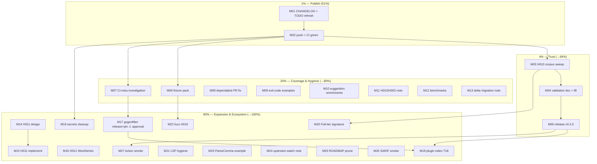

# Pareto Plan — Ship H010, Prove It, Then Cover the Rest

**Date:** 2026-09-18 21:09 · **Source:** `docs/status/2026-09-18_21-05_go-humanize-v1.1.0-h010-rule.md` + `TODO_LIST.md` (T18, T20)
**Scope:** everything surfaced after the go-humanize v1.1.0 session (H010 rule landed, suite green locally, **nothing pushed yet**).

## Context (what this plan decides about)

The H010 (`manual-comma-parse`) rule is fully implemented and locally verified
(build/test/race/lint/self-scan/discrimination proof), but it is **invisible to
users**: commits sit local, CI has not run them, CHANGELOG has no entry, and the
rule's real-world false-positive rate is unmeasured — a deviation from the
linter-building doctrine that this plan closes first.

### Decisions made (autonomous, reversible unless noted)

| #  | Decision                                                                                              | Rationale                                                                                                |
| -- | ----------------------------------------------------------------------------------------------------- | -------------------------------------------------------------------------------------------------------- |
| D1 | **Sweep-first release**: run the corpus sweep, then tag v0.3.0.                                       | Doctrine: measured FP rate before a rule gates users' CI. Sweep is ~90 min; release follows same day.     |
| D2 | **Leave the daemon's heuristic commits as-is.** No history rewrite.                                   | Rewriting shared history for cosmetics risks more than it buys. Curated commits happen for FUTURE work.   |
| D3 | **Unswept-rule policy**: enabled-by-default allowed only with (a) ≥3 signal forms incl. a Full tier, (b) 4-class negative corpus, (c) "sweep pending" doc note, (d) sweep within 7 days. H010 meets a–c; (d) is Tier-1 here. | Pragmatic middle between ship-fast and doctrine-strict; encoded so future rules follow it. |

## Pareto Breakdown

### The 1% that delivers 51% — PUBLISH SLICE
`CHANGELOG 0.3.0-unreleased entry` + `TODO_LIST refresh` + `push` + `CI green`.
~60 min of work converts the entire H010 session from local-only to
on-the-record for every user of `main`. Nothing else matters if this doesn't land.

### The 4% that delivers 64% — TRUST SLICE
`H010 corpus sweep` → `validation doc + docs fill` → `tag v0.3.0 release`.
Turns "fixture-tested rule" into "measured rule behind a tagged release" — the
difference users and the golangci plugin index actually trust.

### The 20% that delivers 80% — COVERAGE & HYGIENE SLICE
`H010 fixture pack` (alias/dot/scoped-nolint/rune-loop/NewReplacer-neg),
`CI-miss investigation` (why the stale gogenfilter test never failed CI),
`dependabot PR fix`, `exit-code example alignment`, `suggestion enrichments`
(BytesN/BigComma/CommafWithDigits), `H010↔H002 non-overlap note`, `benchmarks`,
`delta migration note`. Hardens what shipped; kills known unknowns.

### The other 80% (to reach 100%) — EXPANSION & ECOSYSTEM
New rules (H011 manual-SI-parse, H012 WordSeries/Oxford), gogenfilter release +
pin bump (T20), plugin-index submission (T18), DEPLOY_KEY cleanup, Full-tier
signature refinement, fuzzing, examples, ROADMAP/doc polish, smoke tests.

---

## Medium Plan — 27 tasks, 15–100 min each (sorted by importance → impact → effort → customer value)

| #    | Task                                                            | Tier | Impact | Effort | Customer value | Depends on |
| ---- | --------------------------------------------------------------- | ---- | ------ | ------ | -------------- | ---------- |
| M01  | CHANGELOG `Unreleased/0.3.0` entry + TODO_LIST refresh           | 1%   | High   | 30m    | Users see what changed | –          |
| M02  | Push `main` + watch CI to green + triage failures                | 1%   | High   | 30m    | H010 becomes reachable  | M01        |
| M03  | H010 corpus sweep over `~/projects` (327 repos) + triage         | 4%   | High   | 90m    | Measured FP rate       | M02        |
| M04  | Validation doc + fill H010.md/FEATURES Validation sections       | 4%   | High   | 30m    | Trust artifacts        | M03        |
| M05  | Release v0.3.0: checklist, annotated tag, watch release.yml, verify `go get` | 4% | High | 45m | Tagged release with H010 | M02, M04 |
| M06  | H010 fixture pack: aliased, dot-import, scoped-nolint, rune-loop-positive, NewReplacer-negative | 20% | Med-High | 60m | Alias coverage parity with H007 | M02 |
| M07  | Investigate why the stale gogenfilter test never failed CI       | 20%  | High   | 45m    | CI trust restored      | M02        |
| M08  | Fix dependabot actions-group PR (red since 09-17)                | 20%  | Medium | 30m    | Green CI stays green   | –          |
| M09  | Align `doc.go`/README examples to `ExitCodeByConfidence` (ADR 0003) | 20% | Medium | 30m | Correct copy-paste API | –          |
| M10  | Suggestion enrichments: H001 +BytesN/IBytesN, H002 +BigComma, H009 +CommafWithDigits | 20% | Medium | 45m | Better autofix guidance | –          |
| M11  | H010↔H002 non-overlap note + docs cross-links (read-vs-write patterns) | 20% | Low-Med | 20m | Docs coherence | –          |
| M12  | Benchmarks: FullRegistry delta + H010 micro-bench                | 20%  | Medium | 30m    | Perf regression guard  | M02        |
| M13  | `--behavior-delta` consumer migration note (H010 adds findings)  | 20%  | Medium | 20m    | No surprise deltas     | –          |
| M14  | H011 design: manual SI-string parsing (upstream `ParseSI`) research + signal design | 80% | Medium | 45m | Future rule foundation | –          |
| M15  | H011 implement: pattern + rule + fixtures + docs                 | 80%  | Medium | 100m   | New detection value    | M14        |
| M16  | H012 WordSeries/Oxford hand-roll rule (design+impl+fixtures)     | 80%  | Low-Med | 100m | New detection value    | –          |
| M17  | T20: release gogenfilter sibling + bump pin + `GOWORK=off` sweep **[needs approval: foreign repo tag]** | 80% | High | 60m | Kills workspace split-brain | M07 |
| M18  | T18: submit to golangci-lint plugin index                        | 80%  | High   | 30m    | Discoverability        | M05        |
| M19  | Delete 5 `DEPLOY_KEY_*` secrets + dep-repo deploy keys (AGENTS pending) | 80% | Low | 30m | Security hygiene | M02 (green CI) |
| M20  | Full confidence for var-strip when signature is exactly `(int64\|float64, error)` | 80% | Low-Med | 30m | Fewer triage items | M03 |
| M21  | LSP hygiene: restart gopls, clear stale-diag noise, wsl_v5 check on new files | 80% | Low | 20m | Dev experience | –          |
| M22  | Fuzz tests for H010 pattern helpers                              | 80%  | Low-Med | 45m | Robustness | M06        |
| M23  | `ExampleParseCommaDetect` (DetectFuncDecl-style example)         | 80%  | Low    | 30m    | Docs depth             | –          |
| M24  | Upstream-watch note in AGENTS (go-humanize tag → new-rule pipeline precedent) | 80% | Low | 15m | Repeats the v1.1.0 win | –          |
| M25  | ROADMAP prune: parse-rule ideas covered/superseded by H010       | 80%  | Low    | 30m    | Docs truth             | –          |
| M26  | SARIF/JSON output smoke with H010 findings                       | 80%  | Low    | 20m    | Format confidence      | M02        |
| M27  | GitHub Action smoke test with H010 on a sample repo              | 80%  | Low    | 30m    | Action confidence      | M05        |

---

## Fine Plan — ≤12 min per task (execution order; group = parent M)

| #    | Task (done = verifiable artifact)                                             | Min | Verifies |
| ---- | ----------------------------------------------------------------------------- | --- | -------- |
| F01  | Draft CHANGELOG `Unreleased` section (H010, gogenfilter test realignment, doc fixes) | 10 | file diff |
| F02  | TODO_LIST: add M03–M27 as tracked items, fix stale v3.4.0 text in T20          | 12 | file diff |
| F03  | `git status` clean-check, stage + push `main`                                  | 5  | push output |
| F04  | Watch CI run; confirm test+lint+coverage jobs green                            | 10 | gh run view |
| F05  | Triage any CI failure (buffer)                                                 | 12 | fixes pushed |
| F06  | Build sweep runner: repo list + H010-only CLI invocation script                | 10 | script runs |
| F07  | Run H010-only sweep across `~/projects` corpus                                 | 12 | raw findings |
| F08  | Run full-registry sweep; diff against last known state                         | 12 | delta list |
| F09  | Triage H010 findings batch 1: real / FP / borderline                            | 12 | labeled list |
| F10  | Triage H010 findings batch 2                                                   | 12 | labeled list |
| F11  | Compute per-form FP rate (Full/High/Medium)                                    | 8  | numbers |
| F12  | Keep borderline cases as new fixtures                                          | 12 | fixtures+tests |
| F13  | Write `docs/validation/2026-09-18_h010-sweep.md`                               | 12 | file exists |
| F14  | Fill `docs/rules/H010.md` + FEATURES Validation cells                          | 8  | doc updated |
| F15  | Release pre-check: main CI green, version name, CHANGELOG dated                | 5  | checklist |
| F16  | Create annotated `v0.3.0` tag + push tag                                       | 5  | tag pushed |
| F17  | Watch `release.yml` run to completion                                          | 10 | release URL |
| F18  | Verify Release assets + anonymous `go get @v0.3.0`                             | 12 | clean module |
| F19  | H010 aliased-import fixture + test                                             | 12 | test green |
| F20  | H010 dot-import fixture + test                                                 | 12 | test green |
| F21  | H010 scoped `//nolint:gohumanize:H010` fixture + test                          | 12 | test green |
| F22  | H010 rune-filter-loop positive fixture + test                                  | 12 | test green |
| F23  | H010 `NewReplacer` negative fixture + test                                     | 10 | test green |
| F24  | Timeline: gogenfilter v3.6.0 pin commit vs CI runs (when did suite last run?)  | 8  | timeline |
| F25  | Identify why red test never failed CI (skipped job? stale branch? cron gap?)   | 12 | root cause |
| F26  | Document finding + close the process gap (CI-on-dependency-bump rule)          | 12 | AGENTS/CI |
| F27  | Reproduce dependabot actions-PR failure locally                                | 10 | repro |
| F28  | Fix dependabot PR (push to branch or upstream comment)                         | 12 | PR green |
| F29  | Update `doc.go` library example to `ExitCodeByConfidence`                      | 8  | example green |
| F30  | Update README CLI/library examples to ternary exit codes                       | 8  | docs match |
| F31  | Update `example_test.go` golden output if touched                              | 10 | test green |
| F32  | H001 suggestion: `BytesN`/`IBytesN` when digits signal present + tests         | 12 | message+test |
| F33  | H002 suggestion: `BigComma` for big.Int paths + tests                           | 12 | message+test |
| F34  | H009 suggestion: `CommafWithDigits` variant mention + tests                    | 12 | message+test |
| F35  | Write H010/H002 non-overlap note (AGENTS gotcha, mirrors ADR 0005)             | 10 | doc |
| F36  | Cross-link docs/rules/H002.md ↔ H010.md (inverse operations)                   | 6  | links |
| F37  | Run + record `BenchmarkFullRegistry` with H010                                 | 12 | bench numbers |
| F38  | Add `BenchmarkH010` micro-bench                                                | 12 | bench green |
| F39  | Write `--behavior-delta` migration note (README + AGENTS)                      | 10 | docs |
| F40  | Corpus-research hand-rolled SI parsing patterns (ParseSI candidates)           | 12 | pattern list |
| F41  | Design H011 signals + confidence tiers + negative classes                      | 12 | design note |
| F42  | Implement H011 pattern helpers (batch 1)                                       | 12 | build |
| F43  | Implement H011 pattern helpers (batch 2) + collector                           | 12 | build |
| F44  | H011 rule + registry/CLI/plugin wiring                                         | 12 | suite green |
| F45  | H011 positive fixtures + tests                                                 | 12 | tests green |
| F46  | H011 negative fixtures + tests                                                 | 12 | tests green |
| F47  | H011 docs (rules/H011.md, README, FEATURES, AGENTS)                            | 10 | docs |
| F48  | H012 WordSeries corpus research + design                                       | 12 | design note |
| F49  | H012 pattern + rule + wiring                                                   | 12 | build |
| F50  | H012 fixtures + tests + docs                                                   | 12 | suite green |
| F51  | **[approval]** Tag+release gogenfilter sibling (T20)                           | 12 | tag exists |
| F52  | Bump gogenfilter pin + `go mod tidy` + `GOWORK=off` suite                      | 12 | suite green |
| F53  | Re-run testdata sweep; confirm no detection drift                              | 12 | no delta |
| F54  | Prepare golangci-lint plugin-index submission (T18)                            | 12 | PR draft |
| F55  | Submit plugin-index PR                                                         | 5  | PR open |
| F56  | Delete 5 `DEPLOY_KEY_*` GitHub secrets (post-green-CI)                         | 8  | secrets gone |
| F57  | Remove read-only deploy keys from 4 dep repos                                  | 10 | keys gone |
| F58  | Exact-signature Full tier (var-strip, `(int64\|float64, error)`) + tests       | 12 | test green |
| F59  | Restart gopls; confirm stale diagnostics cleared                               | 5  | clean diags |
| F60  | Check wsl_v5/gocognit config on new files                                      | 8  | lint clean |
| F61  | Fuzz harness for `collectCommaParseEvidence` seeds                             | 12 | fuzz runs |
| F62  | Expand fuzz corpus (strip+parse combinations)                                  | 12 | no crashes |
| F63  | `ExampleParseCommaDetect` runnable example                                     | 12 | example green |
| F64  | Upstream-watch note in AGENTS (v1.1.0 → H010 precedent)                        | 8  | doc |
| F65  | ROADMAP prune: superseded parse-rule ideas                                     | 12 | doc |
| F66  | SARIF/JSON smoke: H010 finding round-trip                                      | 10 | output ok |
| F67  | Action smoke: run action.yml on sample repo with H010                          | 12 | action log |
| F68  | Full regression: `go test ./... -race` + `nix run .#lint` + gofmt              | 12 | all green |
| F69  | Final `git status` clean-check + push                                          | 5  | clean tree |
| F70  | Post-plan sweep: grep `H001..H009` range mentions, fix stragglers              | 10 | grep clean |

---

## Execution Graph (mermaid)

**Critical path:** M01 → M02 → M03 → M04 → M05 → M18 (publish → prove → release → index).
**Parallelizable:** everything in Tier-3 after M02; Tiers-4 freely.

## Verification criteria (plan is DONE when)

- [ ] CI on `main` green with H010 suite (M02)
- [ ] `docs/validation/2026-09-18_h010-sweep.md` exists with per-form FP rates (M03/M04)
- [ ] `v0.3.0` tagged, Release assets verified, anonymous `go get` works (M05)
- [ ] All five H010 fixture gaps closed with green tests (M06)
- [ ] CI-miss root cause documented + process gap closed (M07)
- [ ] Remaining tasks executed or explicitly re-triaged in TODO_LIST (skill: plan = snapshot, TODO_LIST = living source)

## Approval gates

- **F51/M17**: tagging the gogenfilter sibling repo = action in a foreign repo → explicit user approval required before executing.
- **M05**: never tag while CI on `main` red (repo release rule).
