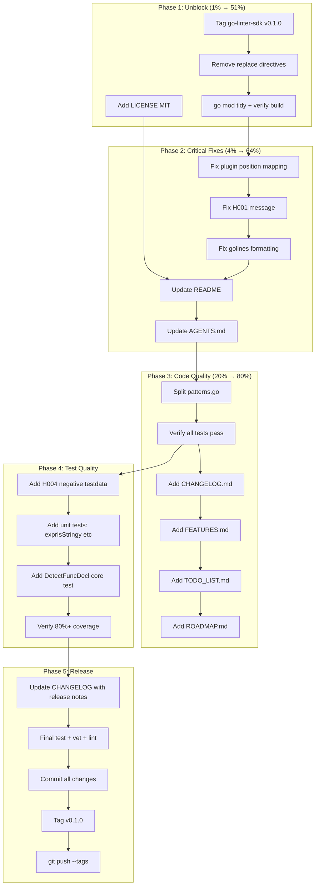

# go-humanize-linter — Production Readiness Plan

> **Date:** 2026-07-30 17:53
> **Goal:** Take go-humanize-linter from "works on my machine" to a shippable v0.1.0 that external users can install, run as a golangci-lint plugin, and trust.

---

## Context

The linter has 7 working rules (H001-H007), 32 passing tests, a CLI, and a golangci-lint plugin wrapper. A full sweep against 190+ projects produced 97 findings with near-zero false positives on 6 of 7 rules (H004 was fixed this session from ~60% FP to ~0%).

**What's blocking v0.1.0:**

- No LICENSE (legal blocker)
- `go.mod` has `replace` directives pointing to `../go-linter-sdk` (no published tag)
- Plugin reports all findings at `func` declaration line, not the actual code line
- H001 message says "0 unit strings" when KMGTPE trick is detected (confusing)
- Missing project docs (CHANGELOG, FEATURES, TODO_LIST, ROADMAP)
- `patterns.go` is 889 lines (should be split)
- README doesn't mention H007 or plugin integration
- AGENTS.md doesn't mention plugin/ or cmd/gohumanize/

---

## Pareto Breakdown

### The 1% that delivers 51%

| #   | Task                                                 | Why                                                                                                                                                    | Impact                  |
| --- | ---------------------------------------------------- | ------------------------------------------------------------------------------------------------------------------------------------------------------ | ----------------------- |
| 1   | Tag go-linter-sdk v0.1.0 + remove replace directives | Nobody outside this machine can `go install` or `go get` the linter while replace directives exist. This single action unblocks all external adoption. | Adoption = 0 → possible |
| 2   | Add LICENSE (MIT)                                    | No license = nobody can legally use it. Every LarsArtmann Go repo uses MIT.                                                                            | Legal blocker removed   |

### The 4% that delivers 64%

| #   | Task                                                  | Why                                                                                                                               | Impact                |
| --- | ----------------------------------------------------- | --------------------------------------------------------------------------------------------------------------------------------- | --------------------- |
| 3   | Fix plugin position mapping                           | Plugin reports ALL findings at `func` keyword line. Useless for IDE integration. Must map `finding.Position` back to `token.Pos`. | Plugin becomes usable |
| 4   | Fix H001 "0 unit strings" message                     | 7 of 27 H001 findings show "0 unit strings" when KMGTPE trick is detected. Confusing and looks broken.                            | Message accuracy      |
| 5   | Update README (add H007, plugin docs, accuracy fixes) | README is the sales page. Missing H007, no plugin integration instructions.                                                       | First impression      |
| 6   | Update AGENTS.md (plugin, H007, new files)            | AGENTS.md is stale — doesn't mention `plugin/`, `cmd/gohumanize/`, `DetectFuncDecl`, H007, or the H004 fix.                       | Session context       |

### The 20% that delivers 80%

| #   | Task                                                                                          | Why                                                                                  | Impact                  |
| --- | --------------------------------------------------------------------------------------------- | ------------------------------------------------------------------------------------ | ----------------------- |
| 7   | Split patterns.go (889 lines → 8 focused files)                                               | Maintainability. Every new detection helper goes into a single god-file.             | Code quality            |
| 8   | Add CHANGELOG.md                                                                              | Standard release hygiene. No change history exists.                                  | Release readiness       |
| 9   | Add negative testdata for H004                                                                | Only positive H004 fixtures exist. The false-positive fix needs regression coverage. | Test quality            |
| 10  | Unit tests for new functions (exprIsStringy, funcReturnsString, isStringType, DetectFuncDecl) | 4 functions added this session have 0% direct coverage.                              | Coverage 74% → 80%+     |
| 11  | Add FEATURES.md, TODO_LIST.md, ROADMAP.md                                                     | Standard project docs. Missing entirely.                                             | Professional appearance |
| 12  | Fix golines formatting violation (rule_bytes.go:68)                                           | Known issue from session 1, never fixed.                                             | Code quality            |
| 13  | Tag go-humanize-linter v0.1.0                                                                 | The release itself.                                                                  | Milestone               |

### The other 20% (polish + future)

| #   | Task                                              | Why                                    |
| --- | ------------------------------------------------- | -------------------------------------- |
| 14  | Add `//nolint:gohumanize` directive support       | Users need to suppress false positives |
| 15  | Self-exclusion: don't flag own source code        | Linter flags its own rule_bytes.go     |
| 16  | example_test.go with runnable Examples            | Godoc discoverability                  |
| 17  | analysistest integration test for plugin          | Plugin.run() is at 0% coverage         |
| 18  | Save validation sweep results to docs/validation/ | FP rate tracking over time             |
| 19  | --version flag on CLI                             | Standard CLI practice                  |
| 20  | Add --rules flag (list all rules)                 | Discoverability                        |

---

## Execution Graph

---

## Phase 1: Unblock (1% → 51%)

### Medium tasks (30-100 min)

| #   | Task                                                                 | Est    | Deps |
| --- | -------------------------------------------------------------------- | ------ | ---- |
| 1.1 | Tag go-linter-sdk v0.1.0                                             | 15 min | —    |
| 1.2 | Remove replace directives from go.mod, update to v0.1.0, go mod tidy | 15 min | 1.1  |
| 1.3 | Verify build + test + vet all pass without replace directives        | 10 min | 1.2  |
| 1.4 | Add LICENSE file (MIT, Copyright 2026 Lars Artmann)                  | 5 min  | —    |

### Fine breakdown (max 12 min)

| #    | Micro-task                                                   | Est   |
| ---- | ------------------------------------------------------------ | ----- |
| 1.1a | Verify go-linter-sdk tests pass + working tree clean         | 5 min |
| 1.1b | `git tag v0.1.0` + `git push origin v0.1.0` on go-linter-sdk | 5 min |
| 1.2a | Remove both `replace` lines from go.mod                      | 3 min |
| 1.2b | Update go-linter-sdk version to v0.1.0 in go.mod require     | 3 min |
| 1.2c | `GOPRIVATE=... go mod tidy`                                  | 5 min |
| 1.3a | `GOEXPERIMENT=jsonv2 go build ./...`                         | 3 min |
| 1.3b | `GOEXPERIMENT=jsonv2 go test ./... -race`                    | 5 min |
| 1.3c | `GOEXPERIMENT=jsonv2 go vet ./...`                           | 3 min |
| 1.4a | Copy MIT LICENSE from go-finding, update year                | 5 min |

---

## Phase 2: Critical Fixes (4% → 64%)

### Medium tasks (30-100 min)

| #   | Task                                                                                   | Est    | Deps    |
| --- | -------------------------------------------------------------------------------------- | ------ | ------- |
| 2.1 | Fix plugin position mapping (store AST node pos in finding metadata)                   | 60 min | Phase 1 |
| 2.2 | Fix H001 "0 unit strings" message when KMGTPE or unitSlice triggers                    | 20 min | —       |
| 2.3 | Fix golines formatting violation in rule_bytes.go:68                                   | 10 min | —       |
| 2.4 | Update README: add H007 row, add plugin integration section, fix rule count            | 30 min | 2.2     |
| 2.5 | Update AGENTS.md: add plugin/, cmd/gohumanize/, DetectFuncDecl, H007, H004 fix details | 30 min | —       |

### Fine breakdown (max 12 min)

| #    | Micro-task                                                                              | Est    |
| ---- | --------------------------------------------------------------------------------------- | ------ |
| 2.1a | Research: how to map finding.Position{Line,Col} back to token.Pos via pass.Fset         | 10 min |
| 2.1b | Implement position mapping in plugin.go run() function                                  | 12 min |
| 2.1c | Test plugin reports correct line numbers via go run ./cmd/gohumanize                    | 10 min |
| 2.1d | Verify existing plugin tests still pass                                                 | 5 min  |
| 2.2a | Read detectBytesFormat, understand the message construction                             | 5 min  |
| 2.2b | Rewrite message to show trigger reason (kmgtp/unitslice/unitcount) instead of raw count | 10 min |
| 2.2c | Verify message on testdata + real findings                                              | 5 min  |
| 2.3a | Run golines on rule_bytes.go, verify diff                                               | 5 min  |
| 2.4a | Add H007 row to README rules table                                                      | 5 min  |
| 2.4b | Add "golangci-lint Plugin" section with .golangci.yml example                           | 10 min |
| 2.4c | Fix rule count from "H001-H006" to "H001-H007" throughout                               | 5 min  |
| 2.4d | Add cmd/gohumanize standalone usage                                                     | 5 min  |
| 2.5a | Add plugin/ and cmd/gohumanize/ to architecture table                                   | 5 min  |
| 2.5b | Add H007 to rules section + detection philosophy                                        | 5 min  |
| 2.5c | Document H004 fix (string-in-branch + string-return-type filters)                       | 10 min |
| 2.5d | Document DetectFuncDecl as shared entry point                                           | 5 min  |

---

## Phase 3: Code Quality (20% → 80%)

### Medium tasks (30-100 min)

| #   | Task                                  | Est    | Deps    |
| --- | ------------------------------------- | ------ | ------- |
| 3.1 | Split patterns.go into per-rule files | 60 min | Phase 2 |
| 3.2 | Add CHANGELOG.md                      | 30 min | —       |
| 3.3 | Add FEATURES.md                       | 30 min | —       |
| 3.4 | Add TODO_LIST.md                      | 30 min | —       |
| 3.5 | Add ROADMAP.md                        | 30 min | —       |

### Fine breakdown (max 12 min)

| #    | Micro-task                                                                                                                                                                                           | Est    |
| ---- | ---------------------------------------------------------------------------------------------------------------------------------------------------------------------------------------------------- | ------ |
| 3.1a | Create pattern_bytes.go: move byte helpers (byteUnitSet, siPrefixStrings, byteUnitRegex, countByteUnits, hasKMGTPEIndex, hasByteUnitSlice, hasDivisionByPowerOf1024, isLiteral1024ish, hasConst1024) | 12 min |
| 3.1b | Create pattern_comma.go: move comma helpers (hasModulo3, hasCommaOrSeparator, hasStepBy3, hasForLoop, hasDigitConversion)                                                                            | 12 min |
| 3.1c | Create pattern_time.go: move time helpers (hasTimeSinceOrSub, hasTimeThresholdComparison)                                                                                                            | 8 min  |
| 3.1d | Create pattern_plural.go: move plural helpers (hasEqualsOneBranch, branchContainsString, exprIsStringy, hasPluralNamedParams, funcReturnsString, isStringType)                                       | 12 min |
| 3.1e | Create pattern_si.go: move SI helpers (hasDivisionBy1000, hasKMSuffix)                                                                                                                               | 8 min  |
| 3.1f | Create pattern_parsebytes.go: move parse helpers (hasByteUnitSuffixChecks, hasByteUnitMultiplierMap)                                                                                                 | 8 min  |
| 3.1g | Create pattern_helpers.go: move shared helpers (unquoteString, allStringLiterals, hasAnyStringLiteral, normLit, getBasicLit, isLiteralInt, isPackageCall, makeFindingWithConfidence)                 | 12 min |
| 3.1h | Delete patterns.go, verify build + tests pass                                                                                                                                                        | 10 min |
| 3.2a | Create CHANGELOG.md with Keep a Changelog format                                                                                                                                                     | 10 min |
| 3.2b | Add Unreleased section with H001-H007, CLI, plugin, H004 fix                                                                                                                                         | 10 min |
| 3.3a | Create FEATURES.md with H001-H007 rule inventory by status                                                                                                                                           | 12 min |
| 3.4a | Create TODO_LIST.md with prioritized backlog from status report                                                                                                                                      | 12 min |
| 3.5a | Create ROADMAP.md with future direction (nolint, more rules, type-aware)                                                                                                                             | 12 min |

---

## Phase 4: Test Quality

### Medium tasks (30-100 min)

| #   | Task                                                       | Est    | Deps    |
| --- | ---------------------------------------------------------- | ------ | ------- |
| 4.1 | Add H004 negative testdata (if x==1 without string return) | 30 min | Phase 3 |
| 4.2 | Add unit tests for new H004 helper functions               | 30 min | —       |
| 4.3 | Add DetectFuncDecl test in core package                    | 20 min | —       |
| 4.4 | Verify 80%+ total coverage                                 | 20 min | 4.1-4.3 |

### Fine breakdown (max 12 min)

| #    | Micro-task                                                                                  | Est    |
| ---- | ------------------------------------------------------------------------------------------- | ------ |
| 4.1a | Create testdata/h004_negative/main.go with if x==1 returning int (SQL health check pattern) | 10 min |
| 4.1b | Add test case in linter_test.go verifying H004 doesn't fire on negative                     | 10 min |
| 4.2a | Add TestExprIsStringy table-driven test (BasicLit, Ident, BinaryExpr, CallExpr)             | 10 min |
| 4.2b | Add TestFuncReturnsString test (string ret, []string ret, error ret, no ret)                | 10 min |
| 4.2c | Add TestIsStringType test (string, []string, int, error)                                    | 8 min  |
| 4.3a | Add TestDetectFuncDecl in linter_test.go testing H001 positive via DetectFuncDecl           | 10 min |
| 4.4a | Run coverage, identify remaining gaps                                                       | 5 min  |

---

## Phase 5: Release

### Medium tasks (30-100 min)

| #   | Task                                      | Est    | Deps |
| --- | ----------------------------------------- | ------ | ---- |
| 5.1 | Final CHANGELOG update with release notes | 15 min | All  |
| 5.2 | Final test + vet + build verification     | 15 min | All  |
| 5.3 | Git commit with detailed message          | 15 min | 5.2  |
| 5.4 | Tag v0.1.0 + push                         | 15 min | 5.3  |

### Fine breakdown (max 12 min)

| #    | Micro-task                                         | Est    |
| ---- | -------------------------------------------------- | ------ |
| 5.1a | Add [0.1.0] section to CHANGELOG with all features | 10 min |
| 5.2a | `GOEXPERIMENT=jsonv2 go test ./... -race -count=1` | 5 min  |
| 5.2b | `GOEXPERIMENT=jsonv2 go vet ./...`                 | 3 min  |
| 5.2c | `GOEXPERIMENT=jsonv2 go build ./...`               | 3 min  |
| 5.3a | `git add -A && git commit` with detailed message   | 10 min |
| 5.4a | `git tag v0.1.0`                                   | 2 min  |
| 5.4b | `git push origin main`                             | 3 min  |
| 5.4c | `git push origin v0.1.0`                           | 3 min  |

---

## Safety Constraints

1. **Never break the build** — run `go build ./...` after every code change
2. **Never break tests** — run `go test ./... -race` after every code change
3. **Never change behavior without test verification** — all fixes must be verified against testdata AND real projects
4. **GOEXPERIMENT=jsonv2** required for ALL go commands
5. **GOPRIVATE=github.com/larsartmann/\*** required for ALL go commands
6. **Don't touch go-finding or go-linter-sdk code** — only tag go-linter-sdk
7. **Don't revert changes from previous sessions** — build on top of them

---

## Resolution (2026-07-30)

**All 20 plan items shipped.** v0.1.0 was tagged (`git tag v0.1.0`) and pushed.
The plugin position-mapping item (#3) was reclassified as a v0.2+ enhancement
(per-line diagnostics) rather than a v0.1.0 blocker; the plugin reports at
`fn.Pos()` by design. Every other phase-1-through-5 task landed. This plan is
complete and has been moved to `archived/`.

